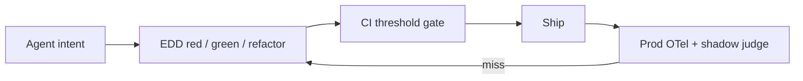
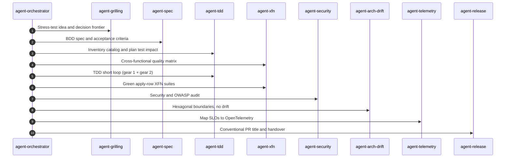

# Kit (Agent Lifecycle Kit)

**Test the tools your agents call.**

When an LLM calls MCP tools, APIs, or terminals, failures are probabilistic: wrong tool, hallucinated args, endless retries. Kit ships **Eval-Driven Development (EDD)** — TDD for tool-using agents — plus the lifecycle, thin context budget, and MCP compose your team needs to run that loop every day.

[](./.github/workflows/ci.yml)
[](./docs/edd.md)
[](https://eval-driven-development.dev/)
[](./LICENSE)

---

## What do I use this for today?

| Job in front of you | Do this |
| :--- | :--- |
| Agent picked the wrong tool / made-up args | Write a JSONL case → `kit eval run --suite evals/edd/architecture_routing.yaml --model scripted` |
| Gate a prompt or schema change | `kit eval ci --threshold-routing 95 --out out/reports` |
| Always-on rules are too fat | `kit measure-context` then `kit check` |
| Starting a product feature | Orchestrator lifecycle (grill → spec → TDD + XFN → audit → release) |
| Never installed kit | [First session on the site](https://eval-driven-development.dev/#onboard) |

Interactive picker + failing-eval demo: [eval-driven-development.dev](https://eval-driven-development.dev/#today).

---

## The value: Eval-Driven Development

**EDD is TDD for agents.** Treat prompts and tool schemas as version-controlled contracts:

1. **Red** — Write a failing eval (JSONL intent + YAML metrics) for the routing or schema you care about.
2. **Green** — Register the MCP/tool contract and system prompt; run until asserts pass.
3. **Refactor** — Tighten descriptions and constraints; gate merges with `kit eval ci --threshold-routing 95`.

```bash
kit eval run --suite evals/edd/architecture_routing.yaml --model scripted
kit eval ci --threshold-routing 95 --out out/reports
kit eval report --format md --out out/reports
```

| | |
| :--- | :--- |
| **Why** | [docs/edd.md](./docs/edd.md) |
| **How** | [SOPs/eval-driven-development.md](./SOPs/eval-driven-development.md) |
| **Suites** | [evals/edd/README.md](./evals/edd/README.md) |
| **Site** | [eval-driven-development.dev](https://eval-driven-development.dev/) |

Context isolation · mocked tools · schema match + LLM-as-a-judge · CI gates · prod→JSONL closed loop.

---

## What else Kit gives you

EDD is the agent default. Around it, Kit standardizes how coding agents work across Cursor, Claude Code, Gemini CLI, Windsurf, and Copilot:

| Pillar | Outcome |
| :--- | :--- |
| **Architecture** | Hexagonal + DDD + vertical slices + clean code ([CODING_PHILOSOPHY.md](./CODING_PHILOSOPHY.md)) |
| **Lifecycle skills** | Spec → TDD short loop → XFN → security → release via `agent-*` roles |
| **One rules file** | `AGENTS.md` syncs to every IDE entry point |
| **MCP catalog** | Composable profiles into `.cursor/mcp.json` ([mcps/](./mcps/)) |
| **Context budget** | Always-on bootstrap under ~8KB; `kit measure-context` / `kit check` ([docs/kit.md](./docs/kit.md)) |
| **Security audit** | Prompt injection, secrets, entropy, unpinned skills (`kit audit`) |



Feature work still follows the orchestrator: Grilling → Spec → TDD + XFN → Audit → Telemetry → Release ([agent-orchestrator](./skills/agent-orchestrator/SKILL.md)).



---

## Quick start

```bash
# Put kit on your PATH (macOS / Linux; needs git and Node 22+)
curl -fsSL https://raw.githubusercontent.com/mzworthington/agent-lifecycle-kit/main/install.sh | sh

# Bootstrap the repo you are in
kit init . --mcp default --hook

# Prove agent tool-routing locally (offline scripted driver)
kit eval ci --threshold-routing 95 --model scripted --out out/reports
```

Already cloned this repo? Run `./install.sh` from the checkout instead.

| Command | Purpose |
| :--- | :--- |
| `kit eval run\|watch\|report\|ci` | **EDD harness** — agent tool routing & schemas |
| `kit eval` | Skill-trigger harness (which specialist activates) |
| `kit init [dir]` | Bootstrap `AGENTS.md`, IDE rules, MCP, pre-commit |
| `kit mcp <profile>` | Compose MCP profiles |
| `kit audit` | Security & supply-chain audit |
| `kit validate` / `kit verify` | Eval schema + skills layout |
| `kit export-rules` | Sync `AGENTS.md` → IDE entry points |
| `kit sync` | Install upstream skills from the lockfile |
| `kit check` | Local quality gate (audit, evals, EDD CI, context budget) |
| `kit measure-context` | Always-on context budget |

---

## Docs map

Start with the path that matches what you’re trying to do:

1. **Prove agents** — [EDD guide](./docs/edd.md) → [EDD SOP](./SOPs/eval-driven-development.md) → [suites](./evals/edd/README.md)
2. **Architecture & bootstrap** — [Coding philosophy](./CODING_PHILOSOPHY.md) → [AGENTS.md](./AGENTS.md)
3. **Skills & MCP** — [skills/README.md](./skills/README.md) → [mcps/README.md](./mcps/README.md)
4. **Quality loops** — [Behavior catalog & XFN](./SOPs/behavior-catalog-and-xfn.md) → [Hypothesis-driven debug](./SOPs/hypothesis-driven-debug.md)
5. **Operators** — [What kit gives you](./docs/kit.md) → [Context budget](./SOPs/context-budget.md) → [MCP library](./SOPs/mcp-library.md)

Site: [eval-driven-development.dev](https://eval-driven-development.dev/) (`#kit` for context/MCP/check; [docs/kit.md](https://eval-driven-development.dev/docs/kit.md))

---

## This checkout

App repos only need `kit` on PATH. This table is for people changing Kit itself:

| Path | Role |
|------|------|
| `bin/kit`, `bin/kit.ts` | CLI on PATH and the argv router |
| `kit/src/` | Implementation and unit tests |
| `evals/` | Skill-trigger JSON suites and EDD YAML/JSONL |
| `skills/`, `mcps/` | Lifecycle skills and MCP catalog |

```bash
pnpm test          # kit/src unit tests + kit-knowledge
pnpm test:ci       # same + Markdown report at out/reports/unit-test-report.md (CI Summary)
pnpm typecheck     # also run by .husky/pre-commit
pnpm check         # tests, then kit check (audit, evals, EDD CI, context budget)
```

---

## License

[Unlicense](./LICENSE) (Public Domain).
