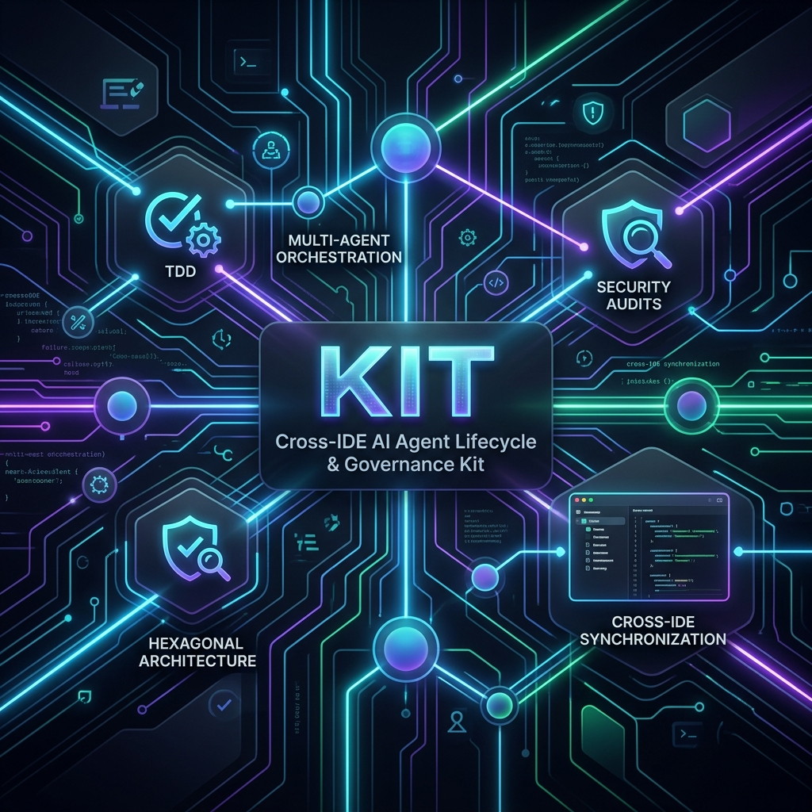
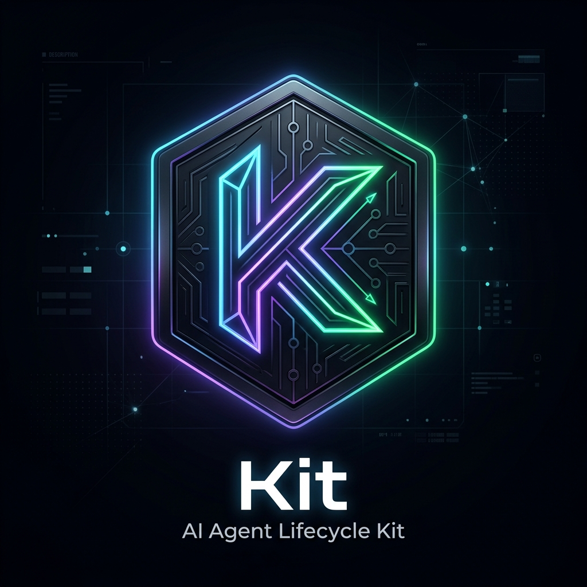
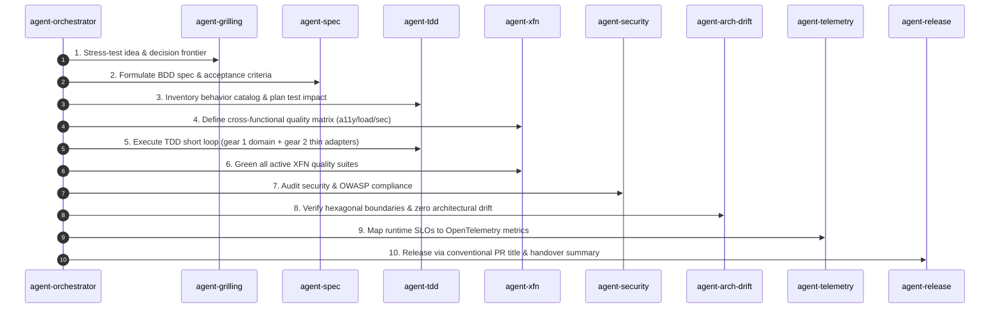

<div align="center">



<br />

# 🤖 Kit (Agent Lifecycle Kit)

**The Autonomous AI Agent Lifecycle, Architecture & Governance Framework.**

[](./.github/workflows/ci.yml)
[](./evals/)
[](./package.json)
[](./LICENSE)

<p align="center">
  <b>Consistent, production-grade AI-assisted software engineering across every IDE and tech stack.</b>
</p>

</div>

---

## ⚡ Why Kit?

AI coding assistants (Cursor, Gemini CLI, Claude Code, Windsurf, GitHub Copilot, Google Antigravity) are powerful—but without strict governance, they drift into inconsistent architecture, swallowed exceptions, skipped tests, and bloated abstractions.

**Kit** gives your team a unified, cross-IDE framework that standardizes how AI agents work: from idea stress-testing, specification, and TDD short loops to security audits, architecture drift detection, and telemetry tracking.

<div align="center">
  
</div>

---

## ✨ Core Pillars

- **🛡️ Shared Architectural Philosophy**: Enforces Hexagonal Architecture (Ports & Adapters), Domain-Driven Design (DDD invariants), Vertical Slice Architecture, and Clean Code standards ([CODING_PHILOSOPHY.md](./CODING_PHILOSOPHY.md)).
- **🔄 Single Source of Truth & Multi-IDE Sync**: Write rules once in [`AGENTS.md`](./AGENTS.md). Kit synchronizes entry points automatically across Cursor (`.cursorrules`), Gemini (`GEMINI.md`), Claude (`CLAUDE.md`), Windsurf (`.windsurfrules`), and Copilot (`.github/copilot-instructions.md`).
- **🎯 43+ Modular Specialist Skills**:
  - **Lifecycle Roles (`agent-*`)**: `agent-orchestrator`, `agent-grilling`, `agent-spec`, `agent-tdd`, `agent-xfn`, `agent-adapter`, `agent-ui`, `agent-migration`, `agent-api-contract`, `agent-review`, `agent-security`, `agent-arch-drift`, `agent-perf-opt`, `agent-debug`, `agent-telemetry`, `agent-pre-commit`, and more.
  - **Language Profiles (`lang-*`)**: `TypeScript`, `Rust`, `Python`, `Go`, `Java`, `C#`, `HCL`.
  - **Framework Profiles (`framework-*`)**: `React 19`, `Next.js`, `Express`, `FastAPI`, `Spring Boot`, `Quarkus`, `.NET`, `Terraform`, `Pulumi`.
  - **Domain Profiles (`profile-*`)**: `profile-api`, `profile-iac`, `profile-mcp`, `profile-observability`.
- **🔒 Hardened Security & Supply Chain Audit**: Built-in scanning for prompt injections, secret leaks, high Shannon entropy tokens, and unpinned external skill dependencies (`pnpm kit audit`).
- **🧪 Automated Evaluation Harness**: Live trigger validation engine evaluating 65+ test cases across 36 suites with 100% accuracy (`pnpm kit eval`).
- **🔌 Versioned MCP Server Catalog**: Composable Model Context Protocol catalog for Linear, Notion, Slack, Sentry, GitHub, and local tooling composed straight into `.cursor/mcp.json` ([mcps/](./mcps/)).

---

## 🧭 Multi-Agent Lifecycle Flow



---

## 🚀 Unified CLI (`kit`)

Kit comes with a unified TypeScript CLI powered by `tsx/esm` for project bootstrapping, rule export, security auditing, and evaluation.

```bash
# Display CLI help menu
pnpm kit help
```

| Command | Purpose |
| :--- | :--- |
| `pnpm kit init [dir]` | Bootstrap `AGENTS.md`, multi-IDE rules, `.cursor/mcp.json`, and git pre-commit hook |
| `pnpm kit mcp <profile>` | Compose and install MCP profiles (`default`, `collab`, `ops`, `security`, `lab`) |
| `pnpm kit audit` | Run hardened security & supply chain audit across skills and scripts |
| `pnpm kit validate` | Validate evals structure against JSON Schemas |
| `pnpm kit eval` | Run live trigger evaluation benchmarks across all skill suites |
| `pnpm kit export-rules` | Export and sync `AGENTS.md` to `GEMINI.md`, `CLAUDE.md`, `.windsurfrules`, `.cursorrules`, and Copilot |
| `pnpm kit metrics` | Display telemetry analytics summary for subagent phase handovers |
| `pnpm kit verify` | Verify skills directory layout conventions |

---

## ⚙️ Quick Start Setup

### 1. Clone & Bootstrap Kit globally

```bash
git clone https://github.com/mzworthington/agent-lifecycle-kit.git ~/Documents/dev/agent-lifecycle-kit
cd ~/Documents/dev/agent-lifecycle-kit
./install.sh
```

This symlinks `~/.agents` -> `~/Documents/dev/agent-lifecycle-kit` and initializes the system configuration.

### 2. Bootstrap any App Repository

Inside any target application project, run the `kit init` command:

```bash
pnpm kit init ./my-app --mcp collab --hook
```

This instantly creates:
- `AGENTS.md` (pointing to Kit core standards)
- Multi-IDE rule entry points (`CLAUDE.md`, `GEMINI.md`, `.windsurfrules`, `.cursorrules`, `.github/copilot-instructions.md`)
- `.cursor/mcp.json` pre-configured with your selected MCP profile
- Executable `.git/hooks/pre-commit` security & quality gate

---

## 📚 Navigation & Documentation

| Resource | Description | Path |
| :--- | :--- | :--- |
| **Coding Philosophy** | Core architectural mandates, DDD, TDD short loop, clean code | [CODING_PHILOSOPHY.md](./CODING_PHILOSOPHY.md) |
| **Skills Directory** | Full taxonomy of 43+ roles, language, framework, and domain profiles | [skills/README.md](./skills/README.md) |
| **MCP Catalog** | Composable Model Context Protocol library and profiles | [mcps/README.md](./mcps/README.md) |
| **Behavior Catalog & XFN** | Testing as source of truth and cross-functional matrices | [SOPs/behavior-catalog-and-xfn.md](./SOPs/behavior-catalog-and-xfn.md) |
| **Hypothesis Debugging** | RCA SOP for bugs, CI failures, and proof gates | [SOPs/hypothesis-driven-debug.md](./SOPs/hypothesis-driven-debug.md) |
| **Conventional Commits** | Commit subject and squash-and-merge PR title rules | [SOPs/conventional-commits.md](./SOPs/conventional-commits.md) |
| **DB Migration SOP** | Expand-contract database schema migration procedure | [SOPs/db-migration.md](./SOPs/db-migration.md) |

---

## 📄 License

[Unlicense](./LICENSE) (Public Domain).
