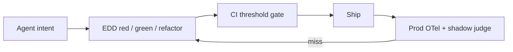

# Kit (Agent Lifecycle Kit)

**Ship AI agents you can prove.**

When an LLM calls MCP tools, APIs, or terminals, failures are probabilistic: wrong tool, hallucinated args, endless retries. Kit makes **Eval-Driven Development (EDD)** the sensible default for that work—TDD for tool-using agents—then wraps it in the lifecycle, architecture, and multi-IDE governance your team already needs.

[](./.github/workflows/ci.yml)
[](./docs/edd.md)
[](https://eval-driven-development.dev/)
[](./LICENSE)

---

## The value: Eval-Driven Development

**EDD is TDD for agents.** Treat prompts and tool schemas as version-controlled contracts:

1. **Red** — Write a failing eval (JSONL intent + YAML metrics) for the routing or schema you care about.
2. **Green** — Register the MCP/tool contract and system prompt; run until asserts pass.
3. **Refactor** — Tighten descriptions and constraints; gate merges with `kit eval ci --threshold-routing 95`.

```bash
kit eval run --suite evals/edd/architecture_routing.yaml --model scripted
kit eval ci --threshold-routing 95 --out out/reports
kit eval report --format md --out out/reports
```

| | |
| :--- | :--- |
| **Why** | [docs/edd.md](./docs/edd.md) |
| **How** | [SOPs/eval-driven-development.md](./SOPs/eval-driven-development.md) |
| **Suites** | [evals/edd/README.md](./evals/edd/README.md) |
| **Site** | [eval-driven-development.dev](https://eval-driven-development.dev/) |

Context isolation · mocked tools · schema match + LLM-as-a-judge · CI gates · prod→JSONL closed loop.

---

## What else Kit gives you

EDD is the agent default. Around it, Kit standardizes how coding agents work across Cursor, Claude Code, Gemini CLI, Windsurf, and Copilot:

| Pillar | Outcome |
| :--- | :--- |
| **Architecture** | Hexagonal + DDD + vertical slices + clean code ([CODING_PHILOSOPHY.md](./CODING_PHILOSOPHY.md)) |
| **Lifecycle skills** | Spec → TDD short loop → XFN → security → release via `agent-*` roles |
| **One rules file** | `AGENTS.md` syncs to every IDE entry point |
| **MCP catalog** | Composable profiles into `.cursor/mcp.json` ([mcps/](./mcps/)) |
| **Security audit** | Prompt injection, secrets, entropy, unpinned skills (`kit audit`) |



Lifecycle feature work still follows: Grilling → Spec → TDD + XFN → Audit → Telemetry → Release ([agent-orchestrator](./skills/agent-orchestrator/SKILL.md)).

---

## Quick start

```bash
git clone https://github.com/mzworthington/agent-lifecycle-kit.git
cd agent-lifecycle-kit && ./install.sh

# Prove agent tool-routing locally (offline scripted driver)
kit eval ci --threshold-routing 95 --model scripted --out out/reports

# Bootstrap an app repo with Kit standards + MCP profile
kit init ./my-app --mcp collab --hook
```

| Command | Purpose |
| :--- | :--- |
| `kit eval run\|watch\|report\|ci` | **EDD harness** — agent tool routing & schemas |
| `kit eval` | Skill-trigger harness (which specialist activates) |
| `kit init [dir]` | Bootstrap `AGENTS.md`, IDE rules, MCP, pre-commit |
| `kit mcp <profile>` | Compose MCP profiles |
| `kit audit` | Security & supply-chain audit |
| `kit export-rules` | Sync `AGENTS.md` → IDE entry points |

---

## Docs map

Start with the path that matches what you’re trying to do:

1. **Prove agents** — [EDD guide](./docs/edd.md) → [EDD SOP](./SOPs/eval-driven-development.md) → [suites](./evals/edd/README.md)
2. **Architecture & bootstrap** — [Coding philosophy](./CODING_PHILOSOPHY.md) → [AGENTS.md](./AGENTS.md)
3. **Skills & MCP** — [skills/README.md](./skills/README.md) → [mcps/README.md](./mcps/README.md)
4. **Quality loops** — [Behavior catalog & XFN](./SOPs/behavior-catalog-and-xfn.md) → [Hypothesis-driven debug](./SOPs/hypothesis-driven-debug.md)

Site: [eval-driven-development.dev](https://eval-driven-development.dev/)

---

## License

[Unlicense](./LICENSE) (Public Domain).
