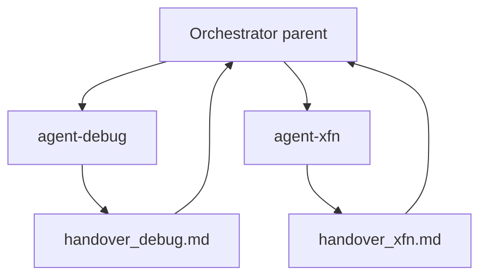

# Standard Operating Procedure: Context budget

Keep always-on agent context small. Load philosophy, SOPs, and skills **on demand**. Prefer **kit-knowledge** and **memory** MCP over dumping files into the prompt. At runtime, keep DOM dumps, test logs, and vendor MCP noise out of the **parent** orchestrator.

## Targets

| Surface | Target |
|---------|--------|
| Always-on bootstrap (`AGENTS.md` + project handshake) | **&lt; ~2k tokens** (~8KB chars). Host pointers are listed, not summed. |
| Skill discovery (descriptions only) | Acceptable; do not pre-load skill bodies |
| Full SOP / philosophy read on typo or debug routes | **Zero** unless the route needs that procedure |
| MCP servers enabled | **One profile** matching the work; match skill `mcp:` frontmatter |

## Split

| Mechanism | Holds |
|-----------|-------|
| Always-on | Invariants + phase→skill index ([AGENTS.md](../AGENTS.md)) |
| Skills | Role/phase behavior when triggered |
| File read / **kit-knowledge** | SOP slices, philosophy sections, handovers |
| **memory** MCP | Glossary, SLOs, prefs across sessions (never secrets) |
| Other MCP | Live systems (GitHub, Context7, browsers, …) |

## Measure

```bash
pnpm kit measure-context
```

Reports character/token estimates for always-on surfaces and flags when over budget. Re-run after editing `AGENTS.md` or project handshake templates. Public write-up: [docs/kit.md](../docs/kit.md).

## Runtime isolation

Always-on files are the static budget. This section is the **session** budget: noisy phases get their own context window. Built-in explore / bash / browser subagents stay for noisy **primitives**. Kit `agent-debug` / `agent-xfn` own phase DoD and the handover. Do not replace those built-ins. Readonly audit agents are a sibling ([docs/subagents.md](../docs/subagents.md)).



| When | Child | Parent keeps |
|------|-------|----------------|
| Bug, failed job, live symptom | `agent-debug` subagent | Hypothesis summary + `handover_debug.md`, not the full log scrape |
| XFN apply rows (browser E2E, load) | `agent-xfn` as a **separate child** from `agent-tdd` | `handover_xfn.md`. TDD does not own browser E2E. |
| Cloudflare-ops or PostHog live work | Skill still applies (often inside the debug child) | Child runs `wk mcp <profile> --project` then `wk mcp restore --project` / `wk mcp default --install`. Do not stack vendor MCP onto default permanently. |
| Tiny typo / obvious one-liner | (none) | Parent may still implement directly |

Launch mechanics: [SOPs/subagent-launch.md](./subagent-launch.md).

## Session checklist

- [ ] Did not bulk-read `CODING_PHILOSOPHY.md` or multiple SOPs before the first edit on a small route
- [ ] Loaded at most one phase skill body for the active route
- [ ] Used kit-knowledge or a single SOP path when a procedure was needed
- [ ] Spec/XFN stored durable facts in memory MCP (or N/A in handover)
- [ ] Only one MCP profile active; unused heavy servers not installed globally
- [ ] Debug / XFN browser-load work ran as a child; parent kept the handover, not the log scrape
- [ ] Named Cloudflare/PostHog profiles were restored to default before returning to the parent
