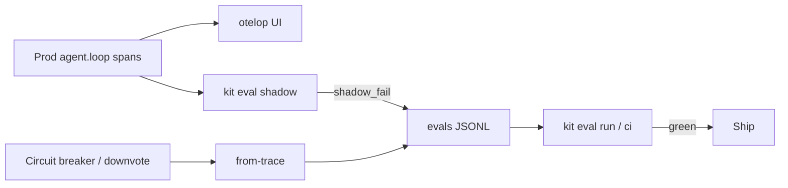

# Standard Operating Procedure: EDD Production Telemetry

Local and CI evals protect predefined intents. Production is unpredictable. Close the EDD loop by using the **same attribute schema** for OTel spans and eval datasets - so yesterday's incident becomes tomorrow's passing case.

## Local viewer (otelop via mise)

Lightweight OSS UI: [otelop](https://github.com/mashiro/otelop) (single binary, DuckDB, OTLP in). Declared in root `mise.toml`.

```bash
# Install mise once: https://mise.jdx.dev/getting-started.html
mise trust && mise install
mise run otelop                    # UI http://127.0.0.1:4319 ; OTLP :4317/:4318
mise run edd:emit-spans            # POST evals/edd/examples kit spans
mise run edd:shadow-demo           # sample + judge example prod turns
mise run otelop:stop
```
Or one shot: `mise run edd:otel-demo`.

| Port | Role |
|------|------|
| `4317` | OTLP gRPC |
| `4318` | OTLP HTTP (JSON or protobuf) |
| `4319` | otelop browser UI |

Retention defaults in mise tasks: **1d / 256MB** (demo-sized, not a warehouse).

## Mechanisms

1. **Standardized trace emitting** - `emitAgentSpan` records prompt, routing confidence, JSON tool payload, latency, and tokens (`kit.*` attributes). Sample span: [evals/edd/examples/otel-agent-loop.json](../evals/edd/examples/otel-agent-loop.json). Convert to OTLP with `kitSpanToOtlpJson` or `mise run edd:emit-spans`.
2. **Asynchronous shadow evals** - Do not judge every live prompt inline. Sample with `shouldShadowEval(0.05)` / `kit eval shadow --infile … --sample 0.05`. Example corpus: [evals/edd/examples/prod-turns.jsonl](../evals/edd/examples/prod-turns.jsonl).
3. **Prod → JSONL** - On unhandled tool exceptions, circuit-breaker trips, user downvotes, or `shadow_fail`, use `productionTraceToJsonl` / `kit eval dataset from-trace`. Example input: [evals/edd/examples/prod-trace.json](../evals/edd/examples/prod-trace.json); catalog case `prod-cb-01` in `architecture_terminal.jsonl`.
4. **Trajectory parity** - Multi-step failures should preserve ordered tool calls in history so `plan_adherence` / trajectory reports can name the failing step after promotion.
5. **Routing drift detection** - Compare tool-share distributions with `detectRoutingDrift`. Alert when e.g. `read_architecture_yaml` drops from ~30% to ~2% traffic.

## Dashboard signals (otelop / queries)

| Signal | Alert when | Where |
|--------|------------|--------|
| Routing accuracy (shadow) | Below CI threshold (default 95%) | Shadow job / `kit.passed` on sampled spans |
| Hallucination rate (judge) | Sustained rise vs baseline week | Shadow fails tagged `shadow_fail` |
| Circuit-breaker trips | Spike vs 7-day baseline | Spans / cases with `circuit_breaker` |
| Tool share drift | Absolute drop ≥ 20 pp | Aggregate `kit.tool_name` → `detectRoutingDrift` |
| Safety suite | Scripted gate or nightly live fails | CI |

Filter otelop traces by `service.name=kit-edd` and attributes `kit.case_id`, `kit.tool_name`, `kit.passed`.

## Closed loop



Yesterday's incident → JSONL (`from-trace` or shadow `--out`) → `kit eval run` → green before release. Keep prod-derived cases tagged `prod-derived`. Redact secrets from uploaded eval reports (harness redacts API-key-like strings in Markdown artifacts).
