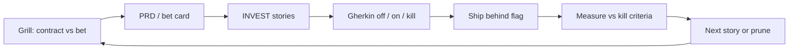

# Standard Operating Procedure: Hypothesis-Driven Development

Owned by [agent-prd](../skills/agent-prd/SKILL.md). Loaded by grilling, user stories, spec, telemetry, release, and prune.

Use this when shipping a **new capability whose value is unproven**. Do **not** use this for bugs — that is [hypothesis-driven-debug.md](./hypothesis-driven-debug.md).

Align with [CODING_PHILOSOPHY.md](../CODING_PHILOSOPHY.md) §4 (minimal change): cheapest experiment first; flag as a delivery port, not as the user want.

## 1. Contract vs bet

| Kind | Meaning | Delivery |
|------|---------|----------|
| **Contract** | Settled obligation. Failure is a defect. | Ship. Flag only if ops needs a kill switch. |
| **Bet** | Belief about user or system outcome. Failure is learning. | Cheapest experiment. Usually a **feature flag default off**. |

If the idea is still mushy, grill first ([agent-grilling](../skills/agent-grilling/SKILL.md)). Do not write Gherkin until the kind is named.

## 2. Bet card (required for bets)

Fill before stories or spec. Template: [templates/prd.md](../templates/prd.md).

| Field | Required |
|-------|----------|
| Problem | Who hurts, and how we know |
| Belief | If we do X for Y, Z will happen |
| Leading indicator | One measurable signal (not vanity) |
| Timebox | When we decide (date or event) |
| Kill criteria | What falsifies the belief |
| Experiment | Cheapest test (flag, preview, fake door, spike) |
| Flag | Name, default, audience, owner, expiry — or **N/A** with reason |

Cap at **one** leading indicator per bet. Park extra metrics.

## 3. Feature flags (when appropriate)

A flag is a **delivery port**, not a story want. Do not write `I want a feature flag`.

**Use a flag when** the slice is a bet, needs a production audience, or needs an operator kill switch.

**Skip a flag when** the change is a contract, fully reversible in one deploy, or the experiment is a throwaway prototype with no production path.

| State | User-visible behavior | Tests |
|-------|----------------------|-------|
| Flag **off** (default for bets) | Prior path; no new obligation | Functional catalog for the safe path |
| Flag **on** | New path for the named audience | Functional + XFN apply rows for the new surface |
| Operator **kills** | Immediate return to off | Spec scenario; rollback note at release |

Record in story **Notes** (not Story/AC): flag name, default, audience, owner, expiry. Spec Gherkin covers off, on, and kill.

Do not leave flags with no expiry. Confirmed bets default **on** then prune the flag. Killed bets stay **off** then prune the slice.

## 4. Loop

1. **Grill** — Frontier includes contract vs bet, metric, timebox, kill criteria, cheapest experiment.
2. **PRD** — [agent-prd](../skills/agent-prd/SKILL.md) writes the bet card. Skip for tiny contracts.
3. **Stories** — [agent-user-stories](../skills/agent-user-stories/SKILL.md): INVEST + Hypothesis block; flag details in Notes.
4. **Spec** — [agent-spec](../skills/agent-spec/SKILL.md): Gherkin for off/on/kill; one telemetry event that can falsify the belief.
5. **Ship** — [agent-release](../skills/agent-release/SKILL.md): flag, default, expiry, rollback.
6. **Measure** — Product usage: [agent-posthog](../skills/agent-posthog/SKILL.md) against the leading indicator (`wk mcp posthog --install`). SLOs and traces: [agent-telemetry](../skills/agent-telemetry/SKILL.md). Not generic logs or a ten-metric dashboard. Two-session filing: [product-signal-intake](./product-signal-intake.md).
7. **Close** — After the timebox: query that indicator, then confirmed → default on + prune flag; killed → flag off + prune slice ([agent-user-stories](../skills/agent-user-stories/SKILL.md), [agent-prune](../skills/agent-prune/SKILL.md)). Next story records the learning.

## 5. Ban list

- Shipping a bet with no kill criteria or no timebox
- Treating “add a flag” as the user-visible want
- Flags without owner or expiry
- Measuring ten things instead of the leading indicator
- Closing a bet as “shipped” without confirmed / killed
- Using the debug hypothesis board for product bets (wrong SOP)
