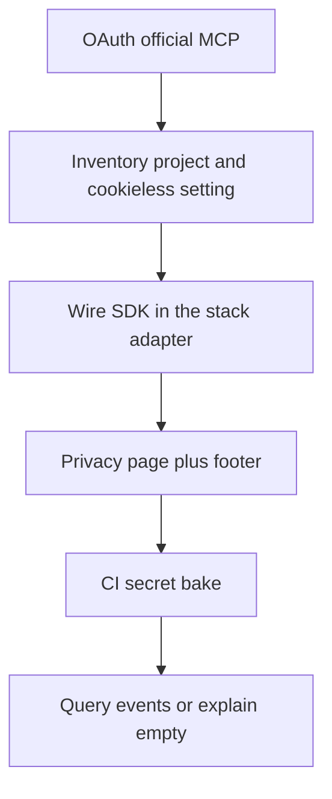

# Standard Operating Procedure: PostHog product analytics

Use with [agent-posthog](../skills/agent-posthog/SKILL.md) and the `posthog` MCP profile. Live product analytics, flags, and errors come from the **official** PostHog MCP (`https://mcp.posthog.com/mcp`). Do not guess dashboard state.

Install once per session: `wk mcp posthog --install` (OAuth on first tool use). One profile only. Restore `wk mcp restore --project` (or `wk mcp default --install`) when the session ends.

## Do not use the wizard in Cursor

`npx @posthog/wizard` / `self-driving` is an interactive TUI. It fails or looks like `self-driving exited.` inside Cursor, can drop Yarn PnP onto a pnpm workspace, and inherits the host MCP list. Wire the SDK from this SOP. Configure scouts and GitHub apps in the PostHog UI.

## Fleet defaults (this org)

| Knob | Value |
|------|--------|
| Env key | `POSTHOG_TOKEN` (project `phc_` key). Public-by-design; still inject at **build** time from a GitHub Actions secret. Never commit it. |
| Ingest | `POSTHOG_HOST`, default `https://a.mzworthington.co.uk` (first-party reverse proxy). Override only when a site cannot use that host. `ui_host` stays `https://eu.posthog.com`. |
| Identity | `cookieless_mode: 'always'`, `person_profiles: 'never'`. No `identify()`. |
| Pageviews | `capture_pageview: 'history_change'` for SPAs and Astro `ClientRouter`. |
| Replay | **Off** on static brochure/docs sites (`disable_session_recording: true`). Product UIs (for example ArchLens Canvas) may enable replay and **must** say so on the privacy page. |
| PostHog project | Enable **Cookieless server hash mode** (project settings → Web analytics). Without it, cookieless events are dropped. |
| Projects | One PostHog project per public site unless the user says to share. |

Missing token: skip `init` in production. In local `development`, log that events will be missed. Do not crash the page.

## Stack adapters

Pick the **existing** package manager. Never `yarn add` on a pnpm/npm repo.

| Stack | Where to init | Token at build |
|-------|---------------|----------------|
| Vite / React SPA | Thin analytics adapter; `PostHogProvider` at the app root when enabled. Vite `envPrefix` must include `POSTHOG_TOKEN` and `POSTHOG_HOST`. | CI bake on the production branch only |
| Astro static | Bundled `<script>` from the document layout (not a React island). Same env prefix in `astro.config` `vite.envPrefix`. | Pages/deploy workflow |
| Jekyll | Layout include before `</body>`. Load `array.js` from EU assets; `api_host` is the reverse proxy. Overlay a generated `_config.posthog.yml` in CI (`jekyll build --config _config.yml,_config.posthog.yml`). Native GitHub Pages **cannot** inject secrets. | Actions build (this org deploys Jekyll via Actions) |

SDK defaults string: `'2026-05-30'` (match current `posthog-js`).

## Privacy notice

Every public site that loads PostHog needs a `/privacy` page (plain language, not legal advice) and a footer link. Say: Cloud EU / reverse proxy, cookieless, no PostHog cookie banner, what hosting still sees, how to ask for deletion (GitHub issues). If session replay is on, say that on-screen content can appear in recordings.

Cloudflare Web Analytics is separate ([cloudflare-analytics-ops](./cloudflare-analytics-ops.md)). Mention both when both snippets exist.

## MCP loop

1. **Auth** - If PostHog tools are missing, stop and tell the user to run `wk mcp posthog --install` and finish OAuth. Do not invent project IDs.
2. **Inventory** - List tools, then the project: region, cookieless hash mode, whether this site already has a `phc_` key.
3. **Wire** - Adapter + tests for config resolve and `init` options. No wizard.
4. **Privacy** - `/privacy` + footer. Copy must match replay on/off.
5. **CI** - `secrets.POSTHOG_TOKEN` (and optional `POSTHOG_HOST`). Document that the agent cannot mint the secret.
6. **Prove** - After deploy, query recent pageviews via MCP. If empty: cookieless mode off, token not baked, ad blockers, or reverse proxy. Unit tests are not live proof.

Do not store `phc_` keys in memory MCP or handovers.

## Ownership

| Piece | Owner |
|-------|--------|
| SDK + privacy page + CI env | Product / site repo |
| Reverse proxy `a.mzworthington.co.uk` | Existing org ingest host; do not invent a second proxy in the product repo |
| Cloudflare RUM beacon | [cloudflare-analytics-ops](./cloudflare-analytics-ops.md) |
| Feature-flag **product bet** mapping | [hypothesis-driven-development](./hypothesis-driven-development.md); PostHog MCP may toggle flags after the bet exists |

MCP **write** calls (flags, dashboards) need explicit user approval.
