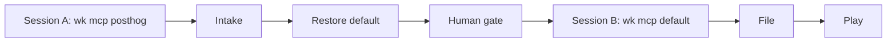

# Standard Operating Procedure: Product-signal intake

Two sessions so PostHog queries never share a profile with Linear. Session A reads product signals. A human gate sits between sessions. Session B files only what the human approved. Play is a later ticket, still on default.

Skills that load this SOP: [agent-posthog](../skills/agent-posthog/SKILL.md) (Session A / Intake), [agent-user-stories](../skills/agent-user-stories/SKILL.md) (Session B / File). Play uses [linear-ticket-workflow](./linear-ticket-workflow.md) and the proposed next agent on each findings row. Wiring the SDK is [posthog-product-analytics](./posthog-product-analytics.md), not this loop.

Do **not** create Linear issues during a PostHog session. Do **not** stack the `posthog` profile onto `default`. Cursor Automations are out of scope.

## Sessions

| Session | Profile | Job |
|---------|---------|-----|
| **Session A** (`wk mcp posthog`) | `wk mcp posthog --install` or `--project` | Intake: query the set below, fill the findings table, stop |
| Restore default when done | `wk mcp default --install` (user scope), `wk mcp default --project`, or `wk mcp restore --project` | Leave the PostHog profile before any Linear work |
| **Session B** (`wk mcp default`) | `wk mcp default --install` or `--project` | File approved rows as Linear stories, then Play each ticket |

One profile per session. If PostHog tools are missing in Session A, stop and tell the operator to install that profile. If Linear tools appear in Session A, the profile is wrong: restore default and start Session B later.

## Loop



1. **Intake** (Session A) - Query PostHog. Write `~/.agents/handover/<project>/posthog-findings.md` from [templates/posthog-findings.md](../templates/posthog-findings.md). Restore default. Stop.
2. **Human gate** - A human reads the table and says which rows become tickets. No Linear create before that yes.
3. **File** (Session B) - On `wk mcp default`, turn approved rows into INVEST stories. Skip `skip` rows.
4. **Play** - Claim and execute one filed ticket at a time ([linear-ticket-workflow](./linear-ticket-workflow.md)). Stay on default.

## Query set (Session A)

Run each row against the live project. Record misses as `skip` with a one-line reason, not as invented tickets.

| Query | What you are looking for |
|-------|--------------------------|
| Errors | New or rising exceptions that name a user-visible path |
| Empty or dropping events | Events that should fire and do not, or a clear drop vs the prior window |
| Funnel drop-offs | A step that loses people after a working previous step |
| Flag exposure vs leading indicator | Flag-on traffic with no movement (or wrong movement) on the bet’s indicator |
| Timeboxed bets due | Bets whose window ended: confirm, kill, or skip if the indicator is still dark |

Evidence is a **window** (dates or “last 7 days”), a trend, and a path or event name. Never a project API key, `phc_` token, or numeric project id. Memory MCP stores the project **name** only.

## Findings table

Every handover row needs all five columns:

| Column | Values |
|--------|--------|
| Signal | One sentence the human can approve or reject |
| Evidence window | Date range or relative window. No project keys |
| Kind | `bug` / `contract` / `bet` / `skip` |
| Size | `sitting` (one sitting) / `epic` (parent of playable children) |
| Proposed next agent | Skill to load after File, or `n/a` on `skip` |

| Kind | Size | Proposed next agent |
|------|------|---------------------|
| bug | sitting | `agent-debug` |
| contract | sitting | `agent-user-stories` (then spec / tdd) |
| contract | epic | `agent-user-stories` (split children first) |
| bet | sitting or epic | `agent-prd` |
| skip | n/a | n/a |

Do not file a `bug` from PostHog without a reproduce path the debug board can use. Do not recast a dark leading indicator as a new bet until [hypothesis-driven-development](./hypothesis-driven-development.md) has a card.

## Saved prompts

Paste in this order so the three steps match the diagram: Intake then File then Play. Each prompt is one session. Restore default at the end of Intake before File.

### Intake

```text
Follow SOPs/product-signal-intake.md Session A (Intake).
Run `wk mcp posthog --install` (or `--project`). Do not stack it onto default. Do not create Linear issues.
Query: errors, empty or dropping events, funnel drop-offs, flag exposure vs leading indicator, timeboxed bets due.
Fill templates/posthog-findings.md into ~/.agents/handover/<project>/posthog-findings.md.
Each row needs signal, evidence window (no project keys), kind (bug / contract / bet / skip), size (sitting / epic), and proposed next agent.
Restore `wk mcp default --install` (or `wk mcp restore --project`) when done. Stop for the human gate.
```

### File

```text
Follow SOPs/product-signal-intake.md Session B (File).
Run `wk mcp default --install` (or `--project`). Linear lives on default, not posthog.
Load ~/.agents/handover/<project>/posthog-findings.md. Create Linear issues only for rows the human approved. Skip `skip` rows.
Use agent-user-stories. Size sitting = one sitting. Size epic = parent plus children. Kind bet goes through agent-prd if no bet card exists.
Do not switch to the posthog profile.
```

### Play

```text
Follow SOPs/product-signal-intake.md (Play) and SOPs/linear-ticket-workflow.md.
Stay on `wk mcp default`. Claim the approved Linear issue In Progress and assign the host agent.
Load the proposed next agent from that findings row. Do not open a PostHog session to file more tickets.
```

## Ban list

- Linear create (or `save_issue`) while Session A / `wk mcp posthog` is active
- Filing before the human gate
- Project keys, `phc_` tokens, or project ids in the findings table, handover, or memory
- ASCII or box-drawing diagrams (Mermaid only)
- A third “insights” role, or Cursor Automations as a substitute for these prompts
