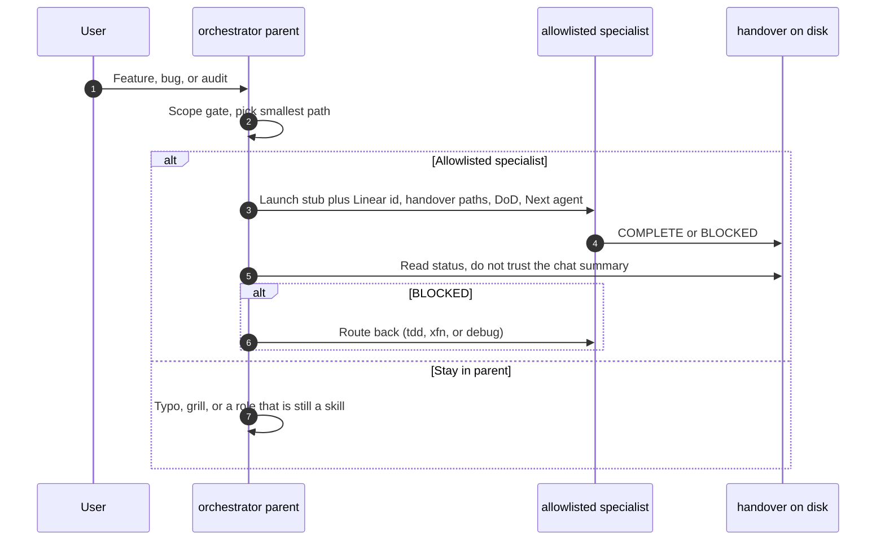

# Launch host subagents

Skills stay the playbook (`SKILL.md`). Host **subagents** are a process boundary: a fresh Cursor Task or Claude subagent, optional `readonly`, optional model class at launch. The parent is `agent-orchestrator`. The contract between windows is the handover file, not the chat summary.

Allowlist and install: [docs/subagents.md](../docs/subagents.md). Model class: [model-routing.md](./model-routing.md) (`wk model resolve --skill <id>`). Do not hardcode vendor slugs.

## Parent must pass

1. Linear id when playing a ticket.
2. Relevant handover paths under `~/.agents/handover/<project>/`.
3. Definition of Done for this phase.
4. Next agent (role skill name).

The child writes `COMPLETE` or `BLOCKED` to the handover and returns a short summary only.

## Routing rules

| Situation | Launch |
|-----------|--------|
| Spec after grilling/stories | `agent-spec` |
| Spec handover `COMPLETE`, implement the slice | `agent-tdd` (gear 1 **and** gear 2 in **one** child) |
| XFN apply rows / browser noise | `agent-xfn` (own window) |
| Failed CI, live symptom, RCA | `agent-debug` (own window). Do not open the full lifecycle. |
| Independent PR / OWASP / hex drift check | `agent-review`, `agent-security`, or `agent-arch-drift` with `readonly: true`. Handover and diff only. `BLOCKED` goes back to tdd or xfn. |
| Tiny typo / one-liner | Stay in the parent. |

Do not generate or launch `lang-*` / `framework-*` / `profile-*` as agents. Load those skills inside the specialist.

Do not split TDD across two agents. `agent-adapter` stays a skill when gear 2 is too large.

Keep **one** MCP profile. If a specialist needs a named profile, `wk mcp <profile> --project`, then restore `wk mcp default --project`.

## Kill

Freeze the generate list if auto-delegation picks the wrong specialist more often than today’s skill picker. Fix thin handovers before adding roles.
