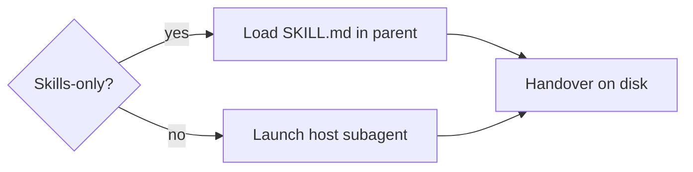
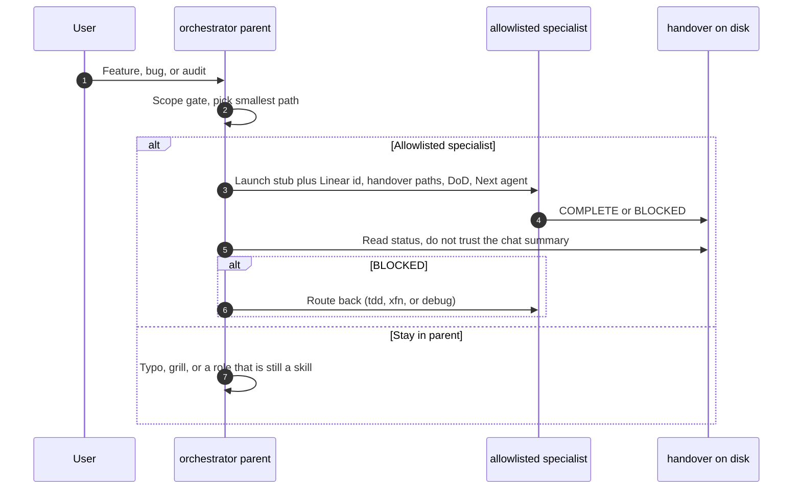

# Launch host subagents

Skills stay the playbook (`SKILL.md`). Host **subagents** are a process boundary: a fresh Cursor Task or Claude subagent, optional `readonly`, optional model class at launch. The parent is `agent-orchestrator`. The contract between windows is the handover file, not the chat summary.

Allowlist and install: [docs/subagents.md](../docs/subagents.md). Model class: [model-routing.md](./model-routing.md) (`wk model resolve --skill <id>`). Do not hardcode vendor slugs.

**Skills-only** (`KIT_SKILLS_ONLY`): when host subagents cost too much, stay in the parent and load the role `SKILL.md`. Default is launch. The generate list and kit stubs stay on disk.





## Parent must pass

1. Linear id when playing a ticket.
2. Relevant handover paths under `~/.agents/handover/<project>/`.
3. Definition of Done for this phase.
4. Next agent (role skill name).

The child writes `COMPLETE` or `BLOCKED` to the handover and returns a short summary only.

## Cursor Task invocation

After `wk agents install`, launch `~/.cursor/agents/<name>.md` as a Cursor **Task** (host subagent). The child does not inherit parent chat. Put Linear id, handover paths, DoD, and Next agent in the Task prompt. Resolve the slug with `wk model resolve --skill <id>`. Do not paste `SKILL.md` into the prompt. When the Task returns, read `COMPLETE` or `BLOCKED` from `~/.agents/handover/<project>/`.

Claude Code: same contract with `~/.claude/agents/<name>.md`.

Keep **one** MCP profile. If the specialist needs Cloudflare or PostHog, `wk mcp <profile> --project`, then restore `wk mcp default --project`. Do not stack vendor MCP onto the default profile.

## Routing rules

| Situation | Launch |
|-----------|--------|
| Spec after grilling/stories | `agent-spec` |
| Spec handover `COMPLETE`, implement the slice | `agent-tdd` (gear 1 **and** gear 2 in **one** child) |
| XFN apply rows / browser noise | `agent-xfn` (own window) |
| Failed CI, live symptom, RCA | `agent-debug` (own window). Do not open the full lifecycle. |
| Independent PR / OWASP / hex drift check | `agent-review`, `agent-security`, or `agent-arch-drift` with `readonly: true`. Handover and diff only. `BLOCKED` goes back to tdd or xfn. |
| Tiny typo / one-liner | Stay in the parent. |

Do not generate or launch `lang-*` / `framework-*` / `profile-*` as agents. Load those skills inside the specialist.

Do not split TDD across two agents. `agent-adapter` stays a skill when gear 2 is too large.

## Skills-only mode

Named switch: environment variable `KIT_SKILLS_ONLY`. Unset, `0`, `false`, `off`, or `no` keeps today’s launch path. `1`, `true`, `on`, or `yes` is skills-only.

When it is on, the parent loads the matching allowlisted role skill in this chat for spec, tdd, debug, xfn, and audit (`agent-review`, `agent-security`, `agent-arch-drift`). Do not launch a host subagent. Still pass Linear id, handover paths, DoD, and Next agent. The child-or-parent writer still writes `COMPLETE` or `BLOCKED` to `~/.agents/handover/<project>/`.

Do not rewrite role `SKILL.md` bodies. Do not delete `agents/` stubs or uninstall `~/.cursor/agents` — that is optional hygiene, not this switch. Do not freeze the generate list to get skills-only; freeze remains the kill for a bad auto-delegation picker.

### Eval path

`wk eval ci --suite evals/edd/subagent_routing.yaml` (and `wk check`) stays the launch suite when the switch is unset.

When `KIT_SKILLS_ONLY` is on, the same JSONL remaps `launch_specialist` → `load_skill` (parent-skill route). `wk check` swaps the CI suite to `evals/edd/subagent_routing_skills_only.yaml`. You can also run that replacement suite directly:

```bash
KIT_SKILLS_ONLY=1 wk eval ci --suite evals/edd/subagent_routing.yaml --threshold-routing 95 --model scripted --out out/reports
KIT_SKILLS_ONLY=1 wk eval ci --suite evals/edd/subagent_routing_skills_only.yaml --threshold-routing 95 --model scripted --out out/reports
```

Turn the switch off and the same PR-review or failed-CI prompt launches the specialist again.

## Kill

Freeze the generate list if auto-delegation picks the wrong specialist more often than today’s skill picker. Fix thin handovers before adding roles. Skills-only is a cost switch, not that freeze.
