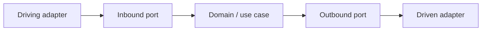

# 0001. Hexagonal + DDD + vertical slices as the default stack

## Context and Problem Statement

Agent Lifecycle Kit steers product teams (and coding agents) toward a single architectural language. Without a recorded default, agents invent ad-hoc layering or force heavy DDD onto throwaway code. We need an irreversible-enough default that still allows documented exceptions.

## Decision Drivers

* Shared vocabulary across languages and frameworks
* Dependency direction that keeps domain logic testable without frameworks
* Feature delivery that avoids shotgun surgery across technical layers
* Escape hatch so small/CRUD/spike work is not over-architected

## Considered Options

* **Option A:** Mandate hexagonal + DDD + vertical slices for all code always
* **Option B:** Soft guidance only; no default stack
* **Option C:** Default stack for product codebases, with explicit applicability and ADR opt-out

## Decision Outcome

Chosen option: "**Option C**", because a strong default improves agent routing and review quality, while [CODING_PHILOSOPHY.md](../../CODING_PHILOSOPHY.md) applicability criteria prevent force-fitting the full stack onto scripts and short-lived CRUD.

### Consequences

* Good, because skills, evals, and audits share one expected shape
* Bad, because newcomers may over-apply ports/aggregates until they read applicability
* Follow-up: keep ADRs sparse; use opt-out notes for one-off exceptions

## Architecture sketch

## Links

* Related ADRs: [0003](./0003-edd-default-for-agent-contracts.md)
* Arch norms: [CODING_PHILOSOPHY.md](../../CODING_PHILOSOPHY.md) Applicability & opt-out
