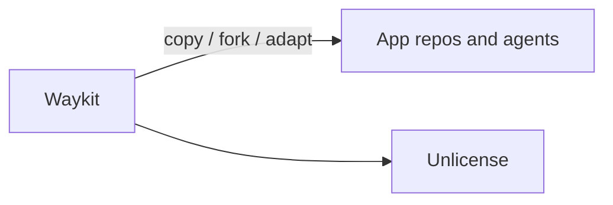

# 0002. Unlicense (public domain dedication)

## Context and Problem Statement

The kit is meant to be copied into many agent and product repos. A restrictive license would slow adoption and create friction for teams that vendor skills/SOPs. We needed a clear dedication of rights.

## Decision Drivers

* Maximum reuse and forkability
* Minimal legal ceremony for agents copying templates
* Honesty that this is tooling/process, not a proprietary product surface

## Considered Options

* **Option A:** MIT / Apache-2.0
* **Option B:** Unlicense (public domain dedication)
* **Option C:** Proprietary / source-available

## Decision Outcome

Chosen option: "**Option B**", because the kit's value is process and prompts that teams must freely adapt; see [LICENSE](../../LICENSE).

### Consequences

* Good, because consumers can copy skills and SOPs without license anxiety
* Bad, because some organizations prefer an explicit copyright grant (MIT) over public-domain language
* Follow-up: if a future npm-published package needs a different posture, record a superseding ADR

## Architecture sketch

## Links

* Related ADRs: none
* License file: [LICENSE](../../LICENSE)
