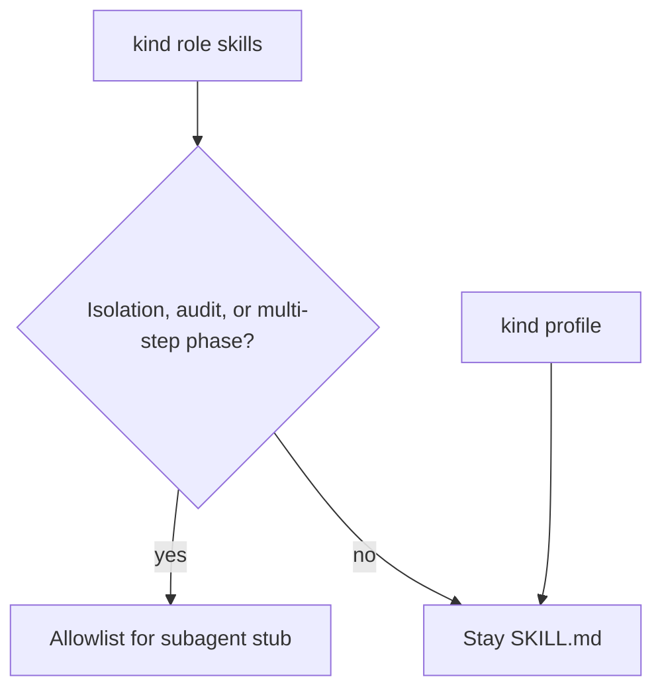

# 0008. Publish a sparse subagent allowlist instead of one agent per skill

## Context and Problem Statement

Cursor can turn specialist roles into subagent stubs. Emitting an agent for every `agent-*` skill would overlap with the skill picker, flood the picker with near-duplicates, and risk promoting `lang-*` / `framework-*` / `profile-*` stack rules into agents. We needed a published allowlist before any generator exists.

## Decision Drivers

* Isolation, readonly audit, and multi-step phases benefit from a separate context window
* Stack profiles are one-shot playbooks, not agents
* TDD gear 1 and gear 2 must stay one session
* A later generator must not invent the list; the list is the source of truth
* Auto-delegation that is worse than today’s skill picker is a kill, not a rollout

## Considered Options

* **Option A:** Generate a Cursor subagent for every `agent-*` role
* **Option B:** Keep everything as skills forever; never publish a stub list
* **Option C:** Publish a small allowlist (isolation, audit, sequential specialists) with orchestrator as parent only; stack prefixes stay-skill; freeze expansion if auto-delegation loses to the skill picker

## Decision Outcome

Chosen option: "**Option C**", because Cursor’s own split is isolation / parallelism / independent verification versus one-shot playbooks, and because a later generator needs a frozen contract. Catalog: [skills/subagents.yaml](../../skills/subagents.yaml). Human copy: [docs/subagents.md](../subagents.md). Taxonomy: [skills/README.md](../../skills/README.md).

This iteration does not generate agent files, change orchestrator launch behaviour, or touch host install paths.

### Consequences

* Good, because maintainers can look up subagents in kit docs or the skills taxonomy and see the same bands
* Good, because `lang-*`, `framework-*`, and `profile-*` cannot become generate-agent without failing `wk verify`
* Bad, because adding a role later is intentionally expensive: freeze if auto-delegation is worse than today's skill picker
* Follow-up: a generator may read `skills/subagents.yaml`; it must not widen the pilot set by default

## Architecture sketch

## Links

* Related ADRs: [0004](./0004-thin-bootstrap-kit-knowledge-one-mcp-profile.md)
* Issue: MZW-59
* Catalog: [skills/subagents.yaml](../../skills/subagents.yaml)
* Docs: [subagent allowlist](../subagents.md)
