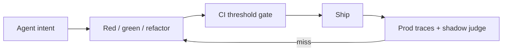
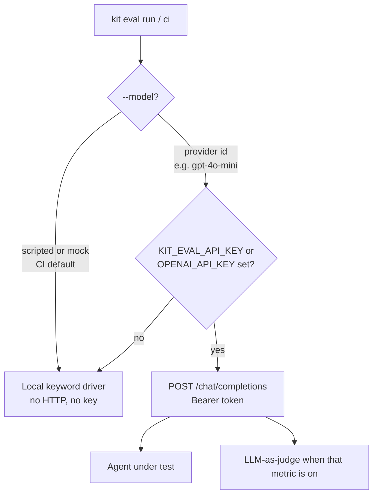

# Eval-Driven Development (EDD)

Connecting an LLM to MCP tools, APIs, or terminals turns a chatbot into a decision-maker. Failures rarely look like stack traces. They look like a wrong tool, a hallucinated parameter, or an infinite retry loop.

EDD treats prompts and tool schemas as version-controlled, evaluated contracts. Agent Lifecycle Kit ships the harness, CI gates, and production closed loop.

## The loop (same shape as TDD)

1. **Red - Define intent.** JSONL cases and YAML metrics assert the tool (and arguments) you expect, and that chatty questions do not invent tool calls.
2. **Green - Implement the interface.** Register the MCP/tool contract and minimal system instructions. Run until asserts pass.
3. **Refactor - Refine context.** Iterate descriptions and constraints without breaking existing cases. Gate merges with `kit eval ci --threshold-routing 95`.



## Why run it this way

| Capability | Outcome |
|------------|---------|
| **Context isolation** | Fresh context per case. No cross-test contamination. |
| **Deterministic mocks** | Measure routing and extraction, not third-party latency. |
| **Dual-layer asserts** | Strict schema match plus optional LLM-as-a-judge. |
| **CI quality gates** | `kit eval ci --threshold-routing 95` blocks routing drift. |
| **Closed-loop telemetry** | Production misses become `.jsonl` cases; shadow evals sample live traffic. |

Bare `kit eval` still validates which Kit skill activates. `kit eval run|watch|report|ci` validates how an agent calls tools. Use EDD whenever you change prompts, tool schemas, or routing.

## Quick start

```bash
curl -fsSL https://raw.githubusercontent.com/mzworthington/agent-lifecycle-kit/main/install.sh | sh
kit init . --mcp default --hook

kit eval run --suite evals/edd/architecture_routing.yaml --model scripted
kit eval ci --threshold-routing 95 --out out/reports
kit eval report --format md --out out/reports
kit eval watch --suite evals/edd/architecture_routing.yaml --target evals/edd
```

`agent-kit` is an alias for `kit`.

## Cursor, Copilot, and API keys

Cursor and GitHub Copilot are **IDE hosts**. They already get Kit skills and the same bootstrap (`AGENTS.md` → `.cursorrules` and `.github/copilot-instructions.md` via `kit export-rules` / `kit init`). Daily work and the merge gate use `--model scripted`. You do **not** need an OpenAI (or any provider) API key for that.

The live-eval key is a **different job**: call a real model over HTTP and ask whether *that* model picks the right tool. Cursor Chat and Copilot Chat are not HTTP eval drivers. The harness cannot send cases into the model sitting in your editor.



`--model scripted` never spends, even if a key is in the environment. Cases tagged `requires-live` are skipped on the scripted driver.

### When a key is used

The runner takes the first non-empty value:

1. `KIT_EVAL_API_KEY` (preferred; this is the secret nightly CI looks for)
2. `OPENAI_API_KEY`
3. `ANTHROPIC_API_KEY`

That value is sent as `Authorization: Bearer …` to an **OpenAI-compatible** `{baseUrl}/chat/completions`. Base URL resolution: `KIT_EVAL_BASE_URL`, then `OPENAI_BASE_URL`, then `https://api.openai.com/v1`.

`ANTHROPIC_API_KEY` is only useful if `KIT_EVAL_BASE_URL` points at a gateway that accepts Anthropic keys on the OpenAI request shape. Anthropic’s native Messages API is not this client.

The same key is reused for:

- **Agent:** given this prompt and these tools, which call do you make?
- **Judge:** optional second completion for `llm_as_judge` / `criteria_judge` / live `task_completion` (falls back to a local heuristic when the model is scripted or no key is set)
- **Phase 1 outcome metrics:** `argument_correctness` (value meaning via `expect.arguments_contains`), `task_completion` (`expect.goal` or expected tool plan), `criteria_judge` (suite `criteria` + `threshold`)
- **Phase 2-4:** safety suite (`evals/edd/safety.yaml`), `kit eval dataset` hygiene, `mcp_use` / `plan_adherence` / `step_efficiency`, trajectory traces, `type: plugin` modules

Optional: `KIT_EVAL_MODEL`, `KIT_EVAL_TOKEN_USD_PER_1K`. Local OpenAI-compatible servers (Ollama, OpenRouter, and similar) work by setting `KIT_EVAL_BASE_URL`.

### CI

| Job | Key | Model | Purpose |
|-----|-----|--------|---------|
| PR [`.github/workflows/agent-evals.yml`](../.github/workflows/agent-evals.yml) | secrets may be injected | defaults to `scripted` | Merge gate: harness + keyword routing |
| Nightly [`.github/workflows/edd-live.yml`](../.github/workflows/edd-live.yml) | **requires** `KIT_EVAL_API_KEY` | repo variable `KIT_EVAL_MODEL` | Paraphrases, prompt-injection, multi-tool |
| `pnpm check` / `kit check` | unused | hardcoded `scripted` | Same as the PR gate, locally |

Nightly **skips the whole job** if `KIT_EVAL_API_KEY` is empty. It does not fall through to `OPENAI_API_KEY`.

### Local live run

```bash
export KIT_EVAL_API_KEY='…'   # or OPENAI_API_KEY
# optional: export KIT_EVAL_BASE_URL='https://api.openai.com/v1'
kit eval run --suite evals/edd/architecture_routing.yaml --model gpt-4o-mini
```

You should then see `requires-live` cases execute instead of “Skipping N requires-live case(s)”.

## Next

| Resource | Purpose |
|----------|---------|
| [SOPs/eval-driven-development.md](../SOPs/eval-driven-development.md) | Day-to-day procedure |
| [evals/edd/README.md](../evals/edd/README.md) | Suites, metrics, layout |
| [SOPs/edd-production-telemetry.md](../SOPs/edd-production-telemetry.md) | OTel, shadow evals, drift |
| [skills/agent-orchestrator/SKILL.md](../skills/agent-orchestrator/SKILL.md) | Feature lifecycle around EDD |
