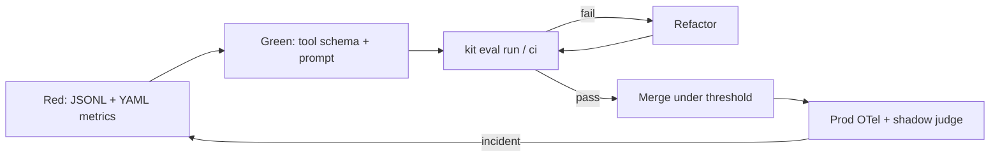

# Eval-Driven Development (EDD)

**EDD is the sensible default for agentic AI development.**

Connecting an LLM to MCP tools, APIs, or terminals turns a chatbot into a decision-maker. Failures rarely look like stack traces—they look like a wrong tool, a hallucinated parameter, or an infinite retry loop. EDD treats prompts and tool schemas as **version-controlled, evaluated contracts**, not informal vibes.

Agent Lifecycle Kit ships the harness, CI gates, and production closed loop so EDD is practical day one—not a blog-post ideal.

## The loop (same shape as TDD)

1. **Red — Define intent.** JSONL cases + YAML metrics assert the tool (and arguments) you expect—and that chatty questions do *not* invent tool calls.
2. **Green — Implement the interface.** Register the MCP/tool contract and minimal system instructions. Run until asserts pass.
3. **Refactor — Refine context.** Iterate descriptions and constraints to kill edge-case hallucinations and token burn—without breaking existing cases.



## Why it is the default

| Capability | Outcome |
|------------|---------|
| **Context isolation** | Fresh context per case—no cross-test contamination |
| **Deterministic mocks** | Measure routing & extraction, not third-party latency |
| **Dual-layer asserts** | Strict schema match + optional LLM-as-a-judge |
| **CI quality gates** | `kit eval ci --threshold-routing 95` blocks routing drift |
| **Closed-loop telemetry** | Production misses become `.jsonl` cases; shadow evals sample live traffic |

Bare `kit eval` still validates *which Kit skill activates*. `kit eval run|watch|report|ci` validates *how an agent calls tools*. Use EDD whenever you change prompts, tool schemas, or routing.

## Quick start

```bash
kit eval run --suite evals/edd/architecture_routing.yaml --model scripted
kit eval ci --threshold-routing 95 --out out/reports
kit eval report --format md --out out/reports
kit eval watch --suite evals/edd/architecture_routing.yaml --target evals/edd
```

`agent-kit` is an alias for `kit`. Live models: set `KIT_EVAL_API_KEY` / `OPENAI_API_KEY`.

## Next

| Resource | Purpose |
|----------|---------|
| [SOPs/eval-driven-development.md](../SOPs/eval-driven-development.md) | Day-to-day procedure |
| [evals/edd/README.md](../evals/edd/README.md) | Suites, metrics, layout |
| [SOPs/edd-production-telemetry.md](../SOPs/edd-production-telemetry.md) | OTel, shadow evals, drift |
| [Blog: Moving Beyond Vibes](./blog/moving-beyond-vibes-edd.md) | Narrative intro |
| [edd/](../edd/) | Public landing page |
