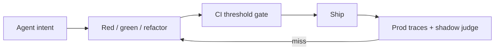

# Eval-Driven Development (EDD)

Connecting an LLM to MCP tools, APIs, or terminals turns a chatbot into a decision-maker. Failures rarely look like stack traces. They look like a wrong tool, a hallucinated parameter, or an infinite retry loop.

EDD treats prompts and tool schemas as version-controlled, evaluated contracts. Agent Lifecycle Kit ships the harness, CI gates, and production closed loop.

## The loop (same shape as TDD)

1. **Red - Define intent.** JSONL cases and YAML metrics assert the tool (and arguments) you expect, and that chatty questions do not invent tool calls.
2. **Green - Implement the interface.** Register the MCP/tool contract and minimal system instructions. Run until asserts pass.
3. **Refactor - Refine context.** Iterate descriptions and constraints without breaking existing cases. Gate merges with `kit eval ci --threshold-routing 95`.



## Why run it this way

| Capability | Outcome |
|------------|---------|
| **Context isolation** | Fresh context per case. No cross-test contamination. |
| **Deterministic mocks** | Measure routing and extraction, not third-party latency. |
| **Dual-layer asserts** | Schema/shape plus argument meaning, task completion, criteria judge, optional LLM-as-a-judge. |
| **CI quality gates** | `kit eval ci --threshold-routing 95` blocks routing drift; safety suite runs in `kit check`. |
| **Closed-loop telemetry** | Production misses become `.jsonl` cases (`kit eval dataset from-trace`); `kit eval shadow` samples live turns into the suite. |
| **Dataset hygiene** | `kit eval dataset lint\|dedupe\|synthesize\|from-trace` keeps suites valid and scalable. |

Bare `kit eval` still validates which Kit skill activates. `kit eval run|watch|report|ci` validates how an agent calls tools. Use EDD whenever you change prompts, tool schemas, or routing.

## Quick start

```bash
curl -fsSL https://raw.githubusercontent.com/mzworthington/agent-lifecycle-kit/main/install.sh | sh
kit init . --mcp default --hook

kit eval run --suite evals/edd/architecture_routing.yaml --model scripted
kit eval ci --threshold-routing 95 --out out/reports
kit eval report --format md --out out/reports
kit eval watch --suite evals/edd/architecture_routing.yaml --target evals/edd
kit eval dataset lint --dataset evals/edd/architecture_routing.jsonl
```

`agent-kit` is an alias for `kit`.

## Cursor, Copilot, and API keys

Cursor and GitHub Copilot are **IDE hosts**. They already get Kit skills and the same bootstrap (`AGENTS.md` → `.cursorrules` and `.github/copilot-instructions.md` via `kit export-rules` / `kit init`). Daily work and the merge gate use `--style local` (alias: `--model scripted`). You do **not** need an OpenAI (or any provider) API key for that.

Each run has **one style** for both the agent under test and the judge:

| Style | Flag | Agent | Judge |
|-------|------|-------|--------|
| **local** | default, `--style local` | Keyword stub | Heuristic patterns |
| **http** | `--style http --model <id>` plus key or `--base-url` | OpenAI-compatible `/chat/completions` | Same HTTP model |
| **cli** | `--style cli --cli cursor-agent --model <id>` | Headless CLI JSON | Same CLI and model |

```mermaid
flowchart TD
  start["kit eval run / ci"] --> style{"--style?"}
  style -->|local / default| local["Keyword agent + heuristic judge"]
  style -->|http| http["Same model over HTTP for agent and judge"]
  style -->|cli| cli["Same CLI binary for agent and judge"]
```

`--style local` never spends, even if a key is in the environment. Cases tagged `requires-live` are skipped on local. `--style http` and `--style cli` run them.

### Cursor Agent CLI as the agent under test

`cursor-agent` is not OpenAI `/chat/completions`. Kit prompts it in `--mode=ask` and expects a JSON envelope `{ "content": "…", "tool_calls": [{ "name": "<eval tool>", "arguments": {} }] }` using only registered eval tools. After a tool call, the harness fills `content` from the mock JSON (quality metrics grade that grounded text). Token totals come from the CLI JSON `usage` object when present (`inputTokens` / `input_tokens` / `prompt_tokens`); otherwise Kit estimates ~4 characters per token. Set `KIT_EVAL_TOKEN_USD_PER_1K` for a rough USD line on the suite summary. Judge calls use the same `--cli` and `--model`.

```bash
noglob kit eval run --suite evals/edd/architecture_routing.yaml \
  --style cli --cli cursor-agent --model cursor-grok-4.6-medium
```

### When a key is used

The runner takes the first non-empty value:

1. `KIT_EVAL_API_KEY` (preferred; this is the secret nightly CI looks for)
2. `OPENAI_API_KEY`
3. `ANTHROPIC_API_KEY`

That value is sent as `Authorization: Bearer …` to an **OpenAI-compatible** `{baseUrl}/chat/completions`. Base URL resolution: `KIT_EVAL_BASE_URL`, then `OPENAI_BASE_URL`, then `https://api.openai.com/v1`.

`ANTHROPIC_API_KEY` is only useful if `KIT_EVAL_BASE_URL` points at a gateway that accepts Anthropic keys on the OpenAI request shape. Anthropic’s native Messages API is not this client.

The same key and model are reused for:

- **Agent:** given this prompt and these tools, which call do you make?
- **Judge:** second completion for `llm_as_judge` / `criteria_judge` / `task_completion`

```bash
# Local model server (no paid key)
kit eval run --suite evals/edd/architecture_routing.yaml \
  --style http --base-url http://localhost:11434/v1 --model llama3.1

# Cursor Agent CLI (agent and judge)
noglob kit eval run --suite evals/edd/architecture_routing.yaml \
  --style cli --cli cursor-agent --model cursor-grok-4.6-medium
```

Prefer **http** for CI merge gates; **cli** for fast local iteration while writing evals (subscription rate limits and weaker structured-output guarantees).

Optional: `KIT_EVAL_MODEL`, `KIT_EVAL_TOKEN_USD_PER_1K` (rough USD on the suite token total). Local OpenAI-compatible servers also work via `KIT_EVAL_BASE_URL`.

## Metrics and suites

Beyond tool selection and schema shape, suites can assert:

| Area | Metrics / tooling |
|------|-------------------|
| Outcome quality | `argument_correctness`, `task_completion`, `criteria_judge` |
| MCP / multi-step | `mcp_use`, `plan_adherence`, `step_efficiency`, trajectory traces in reports |
| Safety | `evals/edd/safety.yaml` (injection + no-tool; in `kit check` and nightly live) |
| Extensibility | `type: plugin` modules; `kit eval dataset lint\|dedupe\|synthesize\|from-trace` |

Full metric table and harness layout: [evals/edd/README.md](../evals/edd/README.md).

### CI

| Job | Key | Model | Purpose |
|-----|-----|--------|---------|
| **Verify** in [`.github/workflows/ci.yml`](../.github/workflows/ci.yml) | unused | `--style local` via `kit check` | Merge gate: harness + keyword routing + safety + recovery |
| Nightly [`.github/workflows/edd-live.yml`](../.github/workflows/edd-live.yml) | **requires** `KIT_EVAL_API_KEY` | repo variable `KIT_EVAL_MODEL` | HTTP paraphrases, prompt-injection, multi-tool, safety |
| `pnpm check` / `kit check` | unused | `--style local` | Same as Verify, locally |

Nightly **skips the whole job** if `KIT_EVAL_API_KEY` is empty. It does not fall through to `OPENAI_API_KEY`.

Verify and the nightly live job (plus Pages deploy) publish a **job summary**: what the gate means, then an EDD overview table and collapsible full report via `kit eval report --github-summary`.

### Local live run

```bash
export KIT_EVAL_API_KEY='…'   # or OPENAI_API_KEY
# optional: export KIT_EVAL_BASE_URL='https://api.openai.com/v1'
kit eval run --suite evals/edd/architecture_routing.yaml --style http --model gpt-4o-mini
```

You should then see `requires-live` cases execute instead of “Skipping N requires-live case(s)”.

## Next

| Resource | Purpose |
|----------|---------|
| [SOPs/eval-driven-development.md](../SOPs/eval-driven-development.md) | Day-to-day procedure |
| [evals/edd/README.md](../evals/edd/README.md) | Suites, metrics, layout |
| [SOPs/edd-production-telemetry.md](../SOPs/edd-production-telemetry.md) | `kit.*` spans, `kit eval shadow`, from-trace, drift |
| [skills/agent-orchestrator/SKILL.md](../skills/agent-orchestrator/SKILL.md) | Feature lifecycle around EDD |
