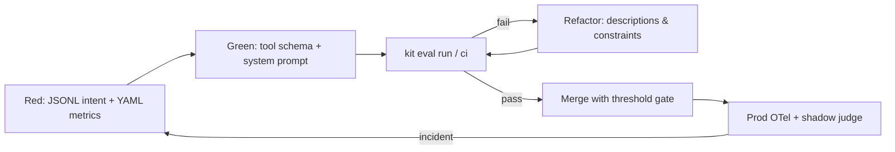

# Eval-Driven Development (EDD)

**Eval-Driven Development** is how Agent Lifecycle Kit turns probabilistic agent behavior into something you can design, test, and ship with confidence.

Connecting an LLM to tools—via Model Context Protocol (MCP) servers, APIs, or terminal hooks—turns a chatbot into a decision-maker. Failures rarely look like stack traces. They look like a wrong tool, a hallucinated parameter, or an infinite retry loop. EDD treats prompts and tool schemas as **version-controlled, evaluated contracts**, not informal vibes.

## What EDD is

EDD adapts classical Test-Driven Development to agentic systems:

1. **Red — Define intent.** Write an evaluation that asserts a user utterance routes to the correct tool with valid arguments (and that conversational questions do *not* invent architecture).
2. **Green — Implement the interface.** Register the MCP/tool contract and minimal system instructions. Run the suite against a target model until assertions pass.
3. **Refactor — Refine context.** Iterate tool descriptions, parameter hints, and system constraints to kill edge-case hallucinations and token burn—without breaking existing cases.



## Why it belongs in Kit

| Capability | What you get |
|------------|--------------|
| **Context isolation** | Every case starts with a fresh context window—no cross-test contamination. |
| **Deterministic mocks** | Tools return stubbed payloads so you measure routing & extraction, not API latency. |
| **Dual-layer asserts** | Strict JSON schema match + optional LLM-as-a-judge for unstructured synthesis. |
| **CI quality gates** | `kit eval ci --threshold-routing 95` blocks merges when routing/schema drift. |
| **Closed-loop telemetry** | Production failures become `.jsonl` regression cases; shadow evals sample ~5% of live traffic. |

EDD sits alongside Kit’s skill-trigger harness: bare `kit eval` validates *which specialist skill activates*; `kit eval run|watch|report|ci` validates *how an agent calls tools*.

## Quick start

```bash
# Offline / CI (deterministic scripted driver)
kit eval run --suite evals/edd/architecture_routing.yaml --model scripted

# Threshold gate + Markdown/JSON artifacts
kit eval ci --threshold-routing 95 --out out/reports

# Readable PR report (writes eval-report.md + edd-report.md / .json)
kit eval report --format md --out out/reports

# Hot-reload while editing prompts or MCP tool schemas
kit eval watch --suite evals/edd/architecture_routing.yaml --target evals/edd
```

`agent-kit` is an alias for `kit`.

## Where to go next

| Resource | Purpose |
|----------|---------|
| [evals/edd/README.md](../evals/edd/README.md) | Suites, metrics, layout |
| [SOPs/eval-driven-development.md](../SOPs/eval-driven-development.md) | Day-to-day EDD procedure |
| [SOPs/edd-production-telemetry.md](../SOPs/edd-production-telemetry.md) | OTel spans, shadow evals, routing drift |
| [evals/edd/examples/eval-report.md](../evals/edd/examples/eval-report.md) | Canonical Markdown report artifact |
| [Blog: Moving Beyond Vibes](./blog/moving-beyond-vibes-edd.md) | Narrative introduction |
| [Release notes](./RELEASE_NOTES_v1.0.0_edd.md) | v1.0.0 EDD harness features |

## One-sentence pitch

**EDD is TDD for agents:** write the failing eval for the intent you care about, green the tool contract and prompt, refactor until routing and schemas hold under CI—and feed production misses straight back into the suite.
