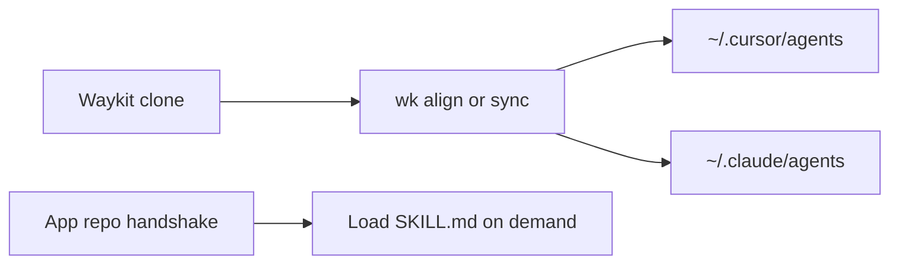

# Hosts: Cursor, Claude Code, Copilot, Antigravity

Lifecycle rules live in `AGENTS.md`. `wk init` and `wk export-rules` write a thin pointer for each host. `wk mcp` writes MCP config in the file that host actually reads. `wk model resolve --host …` maps the same capability class to that host’s model slug.

Windsurf is **rules-only forever**. `wk export-rules` / `wk align` keep `.windsurfrules`. `wk mcp` does not accept `--host windsurf` and does not write a Windsurf MCP file. Cascade’s own MCP UI is outside this kit.

## What each host gets

| Surface | Cursor | Claude Code | GitHub Copilot / VS Code | Antigravity / Gemini CLI |
|---------|--------|-------------|--------------------------|---------------------------|
| Rules | `.cursorrules` | `CLAUDE.md` | `.github/copilot-instructions.md` | `GEMINI.md` |
| Project MCP | `.cursor/mcp.json` | `.mcp.json` | `.vscode/mcp.json` (`servers`) and shared `.mcp.json` | `.agents/mcp_config.json` |
| User MCP | `~/.cursor/mcp.json` | `~/.claude.json` (`mcpServers`) | `~/.copilot/mcp-config.json` | `~/.gemini/config/mcp_config.json` |
| Model overlay | `models/hosts/cursor.yaml` | `models/hosts/claude.yaml` | `models/hosts/copilot.yaml` | `models/hosts/antigravity.yaml` |
| External skills (`wk sync`) | `~/.cursor/skills` | symlink `~/.claude/skills` | not mirrored (use repo `.mcp.json`) | symlink `~/.gemini/skills` |
| Kit subagents (`wk align` / `wk sync` / install) | `~/.cursor/agents` | `~/.claude/agents` | handshake plus skills (no agents dir) | handshake plus skills (no agents dir) |

Canonical content is still `AGENTS.md`, `skills/`, and `mcps/`. Host files are adapters. Kit subagents install to **user** scope so a product clone does not have to commit them. Project `.cursor/agents/` still wins on name conflict. Copilot and Antigravity stay handshake plus skills until those hosts have an equivalent; align does not invent a fake agents dir for them.

Allowlist: [subagents](./subagents.md).



```bash
wk init . --mcp default --hook
wk align .
wk mcp default --install
wk mcp default --install --host claude
wk mcp default --project
wk mcp restore --project
wk model resolve --skill agent-tdd --spec-complete --host claude
wk model resolve --skill agent-tdd --spec-complete --host copilot
wk model resolve --skill agent-tdd --spec-complete --host antigravity
```

`--host` accepts `cursor`, `claude`, `copilot`, `antigravity` (aliases: `gemini`, `agy`), a comma list, or `all` (default).

## What is still host-shaped

Cursor’s in-product skill picker and Task `model` slugs are the deepest. Claude Code and Antigravity pick up Agent Skills from their user skill dirs after `wk sync`. Copilot Chat reads `.vscode/mcp.json`; Copilot’s Agent Host also reads workspace `.mcp.json`.

Kit-authored `skills/agent-*` stay in the Waykit clone (`~/.agents/skills`). Hosts that do not walk that tree still need the handshake: read `~/.agents/AGENTS.md`, then load the skill file.

OAuth popups differ (Cursor vs Claude vs VS Code). Stdio servers that need env vars still need those vars in the process that launches the host.

## EDD vs hosts

The eval runner is `wk`, not the IDE chat. `--style cli --cli cursor-agent|claude|agy` can drive a live host binary. That path is part of [EDD (alpha)](./edd.md), not a complete eval platform.
