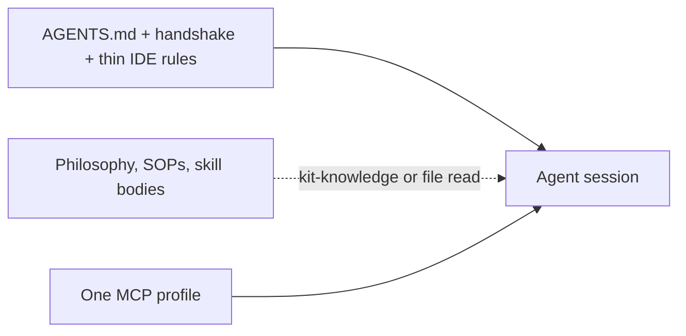

# What Waykit gives you

Waykit is the SDLC for coding agents. The rest of this page is what that install actually puts on disk: a thin handshake, on-demand skills, one MCP profile, a quality gate, and learning loops. Eval-driven development is how you prove tool calls; it is not the whole product.

Independent assessment (value + model-/host-agnosticism) and open follow-ups: [kit-value-and-model-agnostic-review.md](./kit-value-and-model-agnostic-review.md), [kit-review-backlog.md](./kit-review-backlog.md).

## Always-on context

Agents pay for every byte in the bootstrap. Waykit keeps **always-on** files small and loads philosophy, SOPs, and skill bodies **on demand**.

| Surface | In the always-on total? | Target |
|---------|-------------------------|--------|
| `AGENTS.md` + project handshake + thin IDE rules (`.cursorrules`, `CLAUDE.md`) | Yes | **&lt; ~8KB** (~2k tokens) |
| Skill descriptions (frontmatter only) | No (discovery) | Fine; do not pre-load skill bodies |
| `CODING_PHILOSOPHY.md` and SOP files | No | Zero on typo/debug routes unless that procedure is needed |

```bash
wk measure-context
```

Prints a character/token estimate per file and **FAIL** if always-on exceeds 8KB. Re-run after editing `AGENTS.md` or the handshake template. `wk check` runs this gate last.

Agent checklist: [SOPs/context-budget.md](../SOPs/context-budget.md).



## One MCP profile per session

Extra MCP tools compete for attention and inflate tool-schema tokens. Compose **one** named profile:

```bash
wk mcp default --install
wk mcp collab --install
wk mcp ops --install
wk mcp cloudflare-ops --install
```

Match the profile to the skill’s `mcp:` frontmatter. Do not merge collab + devtools + ops into one global `mcp.json`. Catalog: [mcps/README.md](../mcps/README.md). Procedure: [SOPs/mcp-library.md](../SOPs/mcp-library.md).

## Quality gate

`wk check` is the local merge bar:

1. `wk audit`: prompt injection, secrets, entropy, lockfile pins
2. `wk validate` / `wk verify`: eval schemas and skills layout
3. `wk ontology check`: live-derived graph refs (`depends-on`, `mcp`)
4. IDE rules match `AGENTS.md`
5. Skill-trigger evals (registration / prompt hygiene; not a model run) and EDD `wk eval ci` (scripted, 95% routing)
6. Context budget

```bash
wk check
wk audit
wk sync --install
```

`wk sync` installs upstream skills (Cloudflare, Vercel) from [skills/external.lock.json](../skills/external.lock.json) by **version tag** or `latest`, not a guessed commit SHA. [SOPs/external-skills.md](../SOPs/external-skills.md).

## Repo doctor

`wk doctor` is the community-file check for **GitHub sources you admin**, not a glob over every clone. Report-only by default. `--write` fills missing README, license, contributing, security, and GitHub templates and never overwrites existing files. `--owned --scan <dir>` matches local worktrees to `gh repo list --source`. Forks are skipped. `wk init` still owns the handshake and hooks.

Guide: [Repo doctor](./doctor.md).

```bash
wk doctor
wk doctor --owned --scan ~/Documents/dev
wk doctor . --write
```

## Live kit graph

Skills, SOPs, MCP servers, evals, and docs are one graph derived from the files agents already edit. You do not maintain a second catalog. `wk ontology check` fails dangling `depends-on` and `mcp:` refs. `wk ontology generate` writes a gitignored index for kit-knowledge and the public map.

Browse: [Waykit map](./map.md). Authoring: [Author the Waykit map](/ontology). Decision: [ADR 0005](./ADRs/0005-live-derived-ontology-memory-allowlist.md).

## Commands

Skills and `AGENTS.md` tell the agent what to load. You operate the kit with `wk`: measure always-on context, compose one MCP profile, check community files on repos you admin, and fail the merge bar before CI does. `wk help` lists the rest.

| Command | What it measures or installs |
|---------|------------------------------|
| `wk measure-context` | Always-on bootstrap size vs 8KB |
| `wk doctor` | Community files on owned GitHub sources (`--owned`, `--write`) |
| `wk completion zsh` | Tab-complete `wk` commands (bash: `wk completion bash`) |
| `wk check` | Audit, ontology, evals, EDD CI, context budget |
| `wk ontology check` | Live graph referential integrity |
| `wk ontology generate` | Write gitignored index for kit-knowledge and the map |
| `wk mcp <profile>` | One MCP profile into `mcp.json` |
| `wk audit` | Skills and scripts supply-chain scan |
| `wk eval ci` | Routing accuracy gate (EDD) |
| `wk sync` | Upstream skills from the lockfile |

EDD loop, keys, and CI: [edd.md](./edd.md).
