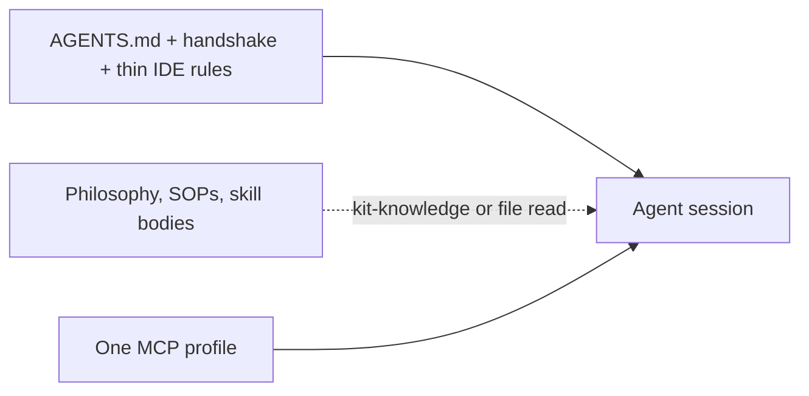

# What kit gives you (beyond EDD)

Eval-Driven Development is how you prove tool calls. The rest of kit exists so that work does not inflate the prompt, mix MCP servers, or skip a gate.

Independent assessment (value + model-/host-agnosticism) and open follow-ups: [kit-value-and-model-agnostic-review.md](./kit-value-and-model-agnostic-review.md), [kit-review-backlog.md](./kit-review-backlog.md).

## Always-on context

Agents pay for every byte in the bootstrap. Kit keeps **always-on** files small and loads philosophy, SOPs, and skill bodies **on demand**.

| Surface | In the always-on total? | Target |
|---------|-------------------------|--------|
| `AGENTS.md` + project handshake + thin IDE rules (`.cursorrules`, `CLAUDE.md`) | Yes | **&lt; ~8KB** (~2k tokens) |
| Skill descriptions (frontmatter only) | No (discovery) | Fine; do not pre-load skill bodies |
| `CODING_PHILOSOPHY.md` and SOP files | No | Zero on typo/debug routes unless that procedure is needed |

```bash
kit measure-context
```

Prints a character/token estimate per file and **FAIL** if always-on exceeds 8KB. Re-run after editing `AGENTS.md` or the handshake template. `kit check` runs this gate last.

Agent checklist: [SOPs/context-budget.md](../SOPs/context-budget.md).



## One MCP profile per session

Extra MCP tools compete for attention and inflate tool-schema tokens. Compose **one** named profile:

```bash
kit mcp default --install
kit mcp collab --install
kit mcp ops --install
kit mcp cloudflare-ops --install
```

Match the profile to the skill’s `mcp:` frontmatter. Do not merge collab + devtools + ops into one global `mcp.json`. Catalog: [mcps/README.md](../mcps/README.md). Procedure: [SOPs/mcp-library.md](../SOPs/mcp-library.md).

## Quality gate

`kit check` is the local merge bar:

1. `kit audit`: prompt injection, secrets, entropy, lockfile pins
2. `kit validate` / `kit verify`: eval schemas and skills layout
3. `kit ontology check`: live-derived graph refs (`depends-on`, `mcp`)
4. IDE rules match `AGENTS.md`
5. Skill-trigger evals and EDD `kit eval ci` (scripted, 95% routing)
6. Context budget

```bash
kit check
kit audit
kit sync --install
```

`kit sync` installs upstream skills (Cloudflare, Vercel) from [skills/external.lock.json](../skills/external.lock.json) by **version tag** or `latest`, not a guessed commit SHA. [SOPs/external-skills.md](../SOPs/external-skills.md).

## Commands

| Command | What it measures or installs |
|---------|------------------------------|
| `kit measure-context` | Always-on bootstrap size vs 8KB |
| `kit check` | Audit, ontology, evals, EDD CI, context budget |
| `kit ontology check` | Live graph referential integrity |
| `kit ontology generate` | Write gitignored index for kit-knowledge and the map |
| `kit mcp <profile>` | One MCP profile into `mcp.json` |
| `kit audit` | Skills and scripts supply-chain scan |
| `kit eval ci` | Routing accuracy gate (EDD) |
| `kit sync` | Upstream skills from the lockfile |

The [kit map](./map.md) is that generated graph in the browser. Authoring (what becomes a node, what the map is not): [Author the kit map](/ontology).

EDD loop, keys, and CI: [edd.md](./edd.md).
