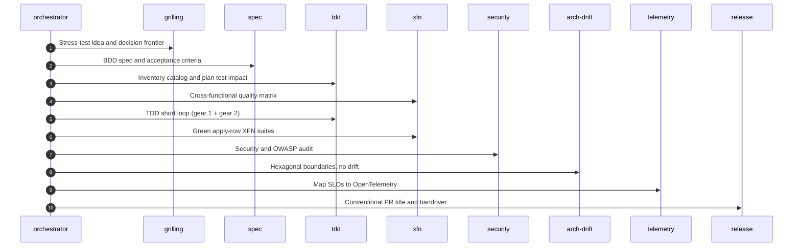

# Feature lifecycle

When the job is a product feature, Waykit routes work through specialist roles: grilling, spec, TDD, cross-functional quality, audit, telemetry, and release. Language and framework profiles load on top of that once the stack is known. EDD is how you prove tool calls; it lives inside TDD when the change is a prompt or a tool schema.

1. **Grilling:** If the idea is still mushy, interview until the decision frontier is clear.
2. **Spec:** Gherkin and acceptance criteria, including cross-functional rows.
3. **TDD:** Inventory the behavior catalog, then gear 1 (domain) and gear 2 (thin adapters) in the same loop. EDD lives here when the change is a prompt or tool schema.
4. **XFN:** Green the apply rows (accessibility, load, security) or skip with a reason.
5. **Audit:** Security and architecture-drift checks, then pre-commit.
6. **Telemetry and release:** Map SLOs, update public docs if you touched them, ship with a conventional PR title.

[Orchestrator skill](https://github.com/mzworthington/waykit/blob/main/skills/agent-orchestrator/SKILL.md) · [Coding philosophy](https://github.com/mzworthington/waykit/blob/main/CODING_PHILOSOPHY.md) · [EDD guide](/docs/edd)
