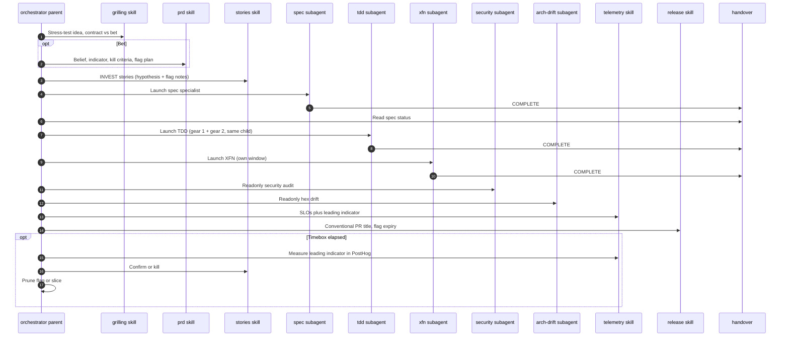

# Feature lifecycle

When the job is a product feature, Waykit routes work through specialist roles: grilling, PRD/bet (when the value is unproven), stories, spec, TDD, cross-functional quality, audit, telemetry, and release — then confirm or kill flagged bets. Language and framework profiles load on top of that once the stack is known. The **orchestrator stays in the parent chat**. Isolation, sequential, and readonly-audit roles on the [subagent allowlist](/docs/subagents) launch as host subagents; they write `COMPLETE`/`BLOCKED` to the handover ([subagent launch](/SOPs/subagent-launch)). EDD (**alpha**) is how you prove tool routing in CI; it lives inside TDD when the change is a prompt or a tool schema. Product bets: [hypothesis-driven development](/SOPs/hypothesis-driven-development). Bugs: [hypothesis-driven debug](/SOPs/hypothesis-driven-debug).

1. **Grilling:** If the idea is still mushy, interview until the decision frontier is clear — including contract vs bet.
2. **PRD / bet:** For bets, write problem, belief, leading indicator, timebox, kill criteria, cheapest experiment, and flag plan (`agent-prd`). Tiny contracts may skip this.
3. **Stories then spec:** INVEST tickets (Hypothesis block on bets; flags in Notes), then Gherkin including flag off/on/kill when flagged.
4. **TDD:** Inventory the behavior catalog (both flag states), then gear 1 (domain) and gear 2 (thin adapters) in the **same** `agent-tdd` subagent. Claim the Linear issue In Progress and assign the host agent first ([linear ticket workflow](/SOPs/linear-ticket-workflow)). Stay on main, uncommitted; output the conventional commit subject with the ticket id. EDD lives here when the change is a prompt or tool schema.
5. **XFN:** Launch `agent-xfn` as a **separate child** from TDD to green the apply rows (accessibility, load, security) or skip with a reason — including flag-on surfaces in scope. Parent reads `handover_xfn.md`.
6. **Audit:** Security and architecture-drift checks, then pre-commit.
7. **Telemetry and release:** Map SLOs (`agent-telemetry`) and the bet’s leading indicator in PostHog (`agent-posthog`). Ship with a conventional PR title, record flag expiry and rollback.
8. **Close the loop:** After the timebox, measure that leading indicator in PostHog (`wk mcp posthog --install`). Then confirm (default on, prune flag) or kill (flag off, prune slice) via `agent-user-stories` and `agent-prune`. Do not add a separate product-insights role.

[Orchestrator skill](https://github.com/mzworthington/waykit/blob/main/skills/agent-orchestrator/SKILL.md) · [Coding philosophy](https://github.com/mzworthington/waykit/blob/main/CODING_PHILOSOPHY.md) · [EDD guide (alpha)](/docs/edd) · [Hosts](/docs/hosts) · [Subagent allowlist](/docs/subagents)
