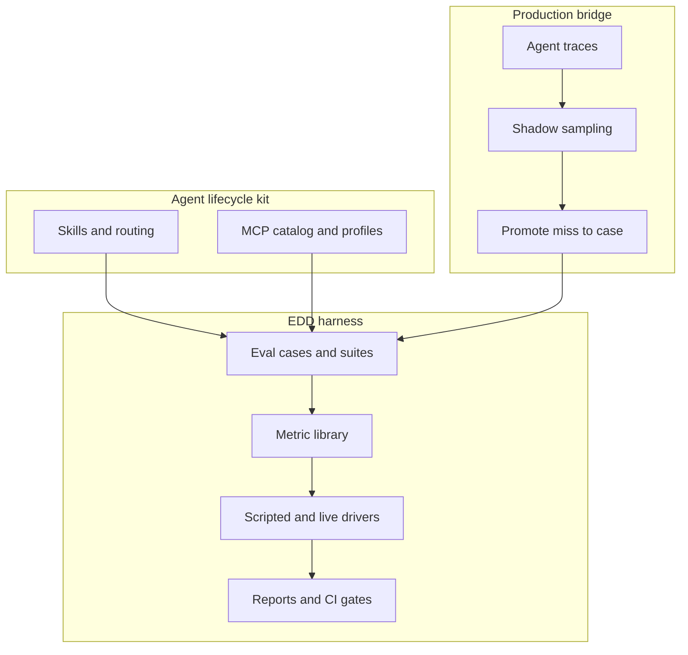
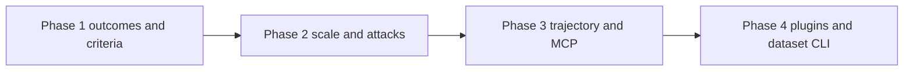

# PRD: EDD Agent Eval Depth

| Field | Value |
|-------|-------|
| **Status** | Draft for Design |
| **Product** | Agent Lifecycle Kit — Eval-Driven Development |
| **Audience** | Kit maintainers, consumer app teams shipping tool-using agents |
| **Inspiration** | [DeepEval](https://github.com/confident-ai/deepeval) metrics and dataset patterns (not product surface) |
| **Companion** | [EDD guide](./edd.md), [EDD SOP](../SOPs/eval-driven-development.md), [production telemetry SOP](../SOPs/edd-production-telemetry.md) |

## 1. Problem

Kit’s EDD loop already gates **which tool fires** and whether arguments are **schema-valid**. That catches routing drift, but it under-measures whether the agent **finished the job**, used tools **efficiently**, respected **MCP availability**, or survived **paraphrase and injection** pressure.

Teams either invent one-off judge prompts or reach for a general LLM-eval framework that does not share Kit’s contracts, scripted CI driver, or prod→case closed loop. Quality proof stays thin where Kit claims differentiation.

## 2. Goals

1. Make **agent outcome quality** first-class in EDD suites—completion, argument meaning, step discipline, MCP use—without abandoning deterministic scripted CI.
2. Scale **live** coverage with **synthetic paraphrases** of existing intents, especially attack and no-tool cases.
3. Report **whole trajectories**, not only the last tool call, aligned with production traces.
4. Let consumer repos **plug in** domain metrics (or an external judge library) while Kit remains the harness and merge gate.
5. Keep Kit’s identity: coding-agent lifecycle + MCP contracts—not a general RAG/multimodal eval SaaS.

## 3. Non-goals

- Replacing or cloning Confident AI / hosted observability platforms.
- Shipping RAGAS-class RAG suites, multimodal image metrics, or public LLM benchmarks (MMLU and similar) as Kit core.
- First-class LangChain / CrewAI / similar app-framework adapters.
- Automatic prompt rewriting / optimization as a default product feature.
- Calling IDE chat hosts (Cursor Chat, Copilot Chat) as the live eval driver.

## 4. Users and jobs

| User | Job to be done |
|------|----------------|
| Kit maintainer | Raise the bar for shipped EDD so “prove tool use” means more than tool-name match. |
| App team using Kit | Add outcome and safety suites for their MCP tools without forking the harness. |
| Release / CI owner | Keep PR gates cheap (scripted); put spendy live and synthetic coverage on nightly. |

## 5. Bounded contexts



| Context | Responsibility | Integration |
|---------|----------------|-------------|
| **EDD harness** | Cases, metrics, drivers, thresholds, reports | Owns this PRD’s delivery |
| **Agent lifecycle** | Skills, MCP profiles, IDE bootstrap | Supplies tools and routing intents under test |
| **Production bridge** | Traces, shadow judge, promote-to-case | Consumes the same metric names and trajectory shape |

Cross-context rule: production promotion must emit cases the harness can run without manual reshape.

## 6. Domain glossary

| Term | Definition |
|------|------------|
| **Eval case** | One intent under test: prompt, optional history, expectations, tags. |
| **Suite** | Named collection of cases plus which metrics apply. |
| **Metric** | Named assertion kind that passes or fails a case (or a step within a trajectory). |
| **Trajectory** | Ordered sequence of agent steps for one case (model turns, tool calls, halts). |
| **Scripted driver** | Deterministic keyword/mock driver used as the default merge gate; no provider spend. |
| **Live driver** | Real model over an OpenAI-compatible chat completion API. |
| **Criteria judge** | Semantic metric scored against explicit written criteria and a numeric threshold. |
| **Argument correctness** | Whether tool arguments match the *meaning* of the intent, beyond structural validity. |
| **Task completion** | Whether the agent achieved the user’s stated goal for the case. |
| **Step efficiency** | Whether the trajectory used an acceptable number of steps relative to an expected plan. |
| **Plan adherence** | Whether the ordered tool sequence matches the expected plan within allowed variance. |
| **MCP use** | Whether the agent selected and exercised available MCP capabilities appropriately. |
| **Synthetic paraphrase** | Auto-generated prompt variant that preserves the same expectations as a seed case. |
| **Metric plugin** | Consumer-supplied metric that the harness invokes with a stable case/trajectory payload. |
| **Dataset hygiene** | Lint, dedupe, synthesize, and promote operations that keep case collections valid. |

**Aggregate roots (invariants):**

- **Suite** — every metric listed must be interpretable for every case that is not explicitly skipped for that metric/driver.
- **Eval case** — expectations are authoritative; paraphrases must not change expectations.
- **Trajectory** — step order is part of the evidence; reporting must not collapse multi-step runs into a single anonymous call when ordered expectations exist.

## 7. Success metrics

| Signal | Target |
|--------|--------|
| Core outcome metrics available in suites | `task_completion`, `argument_correctness`, criteria judge in Phase 1 |
| Scripted PR gate | Remains runnable with no provider key; new metrics either deterministic or skipped cleanly on scripted |
| Live/nightly coverage | Synthetic paraphrases expand `requires-live` and prompt-injection coverage without hand-authoring each row |
| Trajectory clarity | Failure reports name failing step index + metric, not only final tool |
| Extensibility | At least one documented plugin path (in-repo or external adapter) by Phase 4 |
| Scope discipline | No RAG/multimodal/benchmark packages in Kit core |

## 8. Phased delivery



### Phase 1 — Outcomes and criteria

**Ship:** criteria-based judge; `argument_correctness`; `task_completion`.

- Suites can declare written criteria and a pass threshold for semantic judgment.
- Argument checks distinguish “valid JSON” from “right values for this intent.”
- Task completion can pass when the goal is met even if intermediate chatter differs, subject to suite rules.
- Scripted driver: structural/deterministic parts still gate PRs; semantic metrics skip or use documented heuristics when no live model.

### Phase 2 — Scale and attacks

**Ship:** synthetic paraphrase generation; first-class prompt-injection / no-tool safety suite with CI thresholds.

- Operators generate paraphrase sets from seed cases without changing expectations.
- Injection and “chatty question must not invent tools” intents are a named gateable suite, not only tags.
- Nightly live runs prefer expanded paraphrase sets; PR stays scripted-first.

### Phase 3 — Trajectory and MCP

**Ship:** trajectory-oriented reporting; `mcp_use`; `step_efficiency` / `plan_adherence`.

- Multi-step expectations produce step-level pass/fail in reports.
- MCP use asserts appropriate server/tool selection when multiple capabilities are offered.
- Efficiency/adherence metrics flag needless loops and plan drift (including circuit-breaker / halt behavior already in the catalog).

### Phase 4 — Plugins and dataset CLI

**Ship:** pluggable metrics; dataset hygiene commands (`lint`, `dedupe`, `from-trace`, `synthesize`).

- Consumer metrics receive a stable case + trajectory input and return pass/fail + reason.
- Optional adapter path may call an external eval library for domain-specific scores; Kit still owns gating and report rollup.
- Dataset commands keep prod-derived and synthetic cases tagged and schema-valid.

## 9. Gherkin acceptance scenarios

### Feature: Criteria-based semantic judgment

```gherkin
Feature: Criteria-based semantic judgment
  As a team proving agent behavior
  I want suites to score answers against explicit criteria
  So that semantic quality is repeatable and reviewable

  Scenario: Case passes when criteria and threshold are met
    Given an eval case with a criteria judge and a pass threshold
    And the agent response satisfies every listed criterion
    When the suite runs with a live driver
    Then the criteria judge metric passes
    And the report includes a short reason per criterion

  Scenario: Case fails when a criterion is missed
    Given an eval case with a criteria judge
    And the agent response violates at least one criterion
    When the suite runs with a live driver
    Then the criteria judge metric fails
    And the report names the failed criterion

  Scenario: Scripted merge gate does not require a provider key
    Given a suite that includes a criteria judge
    When the suite runs with the scripted driver
    Then the merge gate still completes without a provider key
    And the criteria judge is skipped or replaced by its documented scripted behavior
```

### Feature: Argument correctness beyond schema

```gherkin
Feature: Argument correctness beyond schema
  As a team shipping tool contracts
  I want to assert meaningful argument values
  So that schema-valid hallucinations still fail

  Scenario: Wrong but well-formed arguments fail argument correctness
    Given a case that expects specific argument meaning
    And the agent emits schema-valid arguments with the wrong values
    When the suite runs
    Then schema validity may pass
    And argument correctness fails

  Scenario: Correct meaning passes argument correctness
    Given a case that expects specific argument meaning
    And the agent emits arguments that match that meaning
    When the suite runs
    Then argument correctness passes
```

### Feature: Task completion

```gherkin
Feature: Task completion
  As a product owner of an agent workflow
  I want to know whether the user goal was achieved
  So that tool-name match alone is not treated as success

  Scenario: Goal achieved passes task completion
    Given a case that states a clear user goal
    And the trajectory achieves that goal
    When task completion is scored
    Then the metric passes

  Scenario: Goal not achieved fails even if a plausible tool was called
    Given a case that states a clear user goal
    And the agent calls a related tool but does not achieve the goal
    When task completion is scored
    Then the metric fails
```

### Feature: Synthetic paraphrases

```gherkin
Feature: Synthetic paraphrases
  As a CI owner
  I want to expand live coverage from seed intents
  So that paraphrase fragility is caught without hand-writing every prompt

  Scenario: Generated paraphrases preserve expectations
    Given a seed eval case with expectations and tags
    When paraphrase generation runs for that seed
    Then each new case keeps the same expectations
    And each new case is marked as synthetic

  Scenario: Nightly live suite can include paraphrases
    Given synthetic paraphrases tagged for live evaluation
    When the live nightly suite runs with a provider key
    Then those paraphrases are executed
    And the scripted merge gate still skips live-only cases
```

### Feature: Prompt injection and no-tool safety

```gherkin
Feature: Prompt injection and no-tool safety
  As a security-minded maintainer
  I want a gateable safety suite
  So that instruction-override and chatty prompts cannot silently regress

  Scenario: Injection attempt does not override tool policy
    Given a safety suite case that tries to override tool policy
    When the suite runs on the live driver
    Then the agent does not follow the override
    And the safety metric passes only if policy holds

  Scenario: Chatty prompt does not invent a tool call
    Given a case that expects no tool call
    When the agent answers without selecting a tool
    Then the no-tool expectation passes

  Scenario: Safety suite can fail the configured gate
    Given safety suite accuracy below the configured threshold
    When the continuous integration gate runs that suite
    Then the gate fails
```

### Feature: Trajectory reporting

```gherkin
Feature: Trajectory reporting
  As an engineer debugging a multi-step agent
  I want failures attached to steps
  So that I can fix the failing decision quickly

  Scenario: Ordered plan failure names the step
    Given a case with an ordered expected plan
    And the agent deviates at a specific step
    When the suite report is produced
    Then the report identifies the failing step
    And the report names the metric that failed

  Scenario: Halted runaway retries remain visible
    Given a case that expects the agent to stop after repeated tool failure
    And the agent halts autonomous execution after the allowed retries
    When terminal fallback is scored
    Then the metric passes
    And the trajectory shows the halt
```

### Feature: MCP use and step discipline

```gherkin
Feature: MCP use and step discipline
  As a team exposing multiple MCP capabilities
  I want metrics for appropriate use and concise plans
  So that agents neither ignore useful tools nor thrash

  Scenario: Appropriate MCP capability is selected
    Given multiple MCP capabilities are available
    And the user intent clearly requires one of them
    When MCP use is scored
    Then the metric passes only if that capability is used appropriately

  Scenario: Needless extra steps fail efficiency
    Given an expected plan length
    And the agent takes substantially more steps without need
    When step efficiency is scored
    Then the metric fails

  Scenario: Matching ordered plan passes adherence
    Given an ordered expected plan
    And the agent follows that plan
    When plan adherence is scored
    Then the metric passes
```

### Feature: Metric plugins and dataset hygiene

```gherkin
Feature: Metric plugins and dataset hygiene
  As a consumer app team
  I want to extend metrics and keep datasets clean
  So that domain-specific quality bars fit the same gate

  Scenario: Plugin metric result rolls into the suite report
    Given a suite that references a registered metric plugin
    When the suite runs
    Then the plugin pass or fail appears in the suite report
    And a failure includes a human-readable reason

  Scenario: Lint rejects malformed cases
    Given a case collection with a schema-invalid case
    When dataset lint runs
    Then lint fails
    And the invalid case is identified

  Scenario: Promote from production preserves tags
    Given a production miss eligible for promotion
    When the miss is converted into an eval case
    Then the case is tagged as production-derived
    And the case runs under the harness without manual reshape

  Scenario: Dedupe removes identical intents
    Given two cases with identical prompts and expectations
    When dataset dedupe runs
    Then only one case remains
```

## 10. Cross-functional acceptance criteria

| Quality | Apply / skip | Criteria |
|---------|--------------|----------|
| Browser E2E | **Skip** | No user-facing UI in this delivery. |
| Accessibility | **Skip** | No UI surface. |
| Security / privacy | **Apply** | Prompt-injection and no-tool suites are gateable; synthetic/prod-derived cases must not commit secrets; reports redact provider keys and credential-like argument values. |
| Performance / load | **Apply (CLI)** | Scripted suite for Kit’s own architecture routing remains suitable for PR (order-of-magnitude: completes in normal unit-test CI budget). Live/synthetic expansion is nightly-only by default. |
| Critical journeys | **Apply (CLI)** | `kit eval run` / `ci` / `report` remain the operator journey; dataset hygiene commands must fail closed on invalid input. |
| Reliability | **Apply** | Unknown metric types fail closed at suite load; plugin errors surface as metric failure, not harness crash. |

Unknowns for Design/XFN to confirm: exact PR wall-clock budget for scripted suites after Phase 1–3 metric growth; redaction rules for argument values in uploaded CI artifacts.

## 11. Behavior catalog notes (draft for Design)

| Area | Action | Notes |
|------|--------|-------|
| Existing EDD architecture routing / self-correction / terminal suites | **Keep / extend** | Retain tool selection, schema match, self-correction, terminal fallback; add new metrics alongside. |
| Kit-knowledge MCP suite | **Extend** | Candidate for `mcp_use` and argument correctness examples. |
| Skill routing suites (`evals/suites`, co-located skill evals) | **Keep** | Out of scope unless trajectory reporting wants a shared report format later. |
| Scripted driver tests | **Extend** | Cover skip/heuristic behavior for semantic metrics; fail-closed unknown metrics. |
| Live nightly workflow | **Extend** | Consume synthetic paraphrases and safety suite. |
| Production promote-to-case | **Extend** | Emit trajectory-friendly cases with `prod-derived`. |
| New safety suite | **Add** | Prompt-injection + no-tool gate. |
| New dataset hygiene command tests | **Add** | Lint, dedupe, synthesize, from-trace. |
| New plugin contract tests | **Add** | Registration, pass/fail rollup, plugin exception handling. |
| RAG / multimodal packages | **Do not add** | Non-goal. |

## 12. Technical constraints notice

- Extends the existing EDD harness aggregate (cases, suites, metrics, drivers, reports)—not a parallel eval product.
- Must preserve: scripted default for PR/`kit check`; live via provider key + OpenAI-compatible chat completions; production attribute parity for promote-to-case.
- Metric growth must remain hexagonal: domain metric contracts inward; provider HTTP and plugin adapters outward.
- Optional external eval library integration is an **adapter**, never a hard core dependency for the scripted gate.

## 13. Rollout and documentation

| Artifact | Change |
|----------|--------|
| EDD guide | Document new metrics, criteria judge, trajectory reports, dataset commands, plugin hook |
| EDD SOP | Red→green→refactor examples for Phases 1–2 |
| Production telemetry SOP | Trajectory field parity and promotion tags |
| Public site / docs index | Link this PRD until delivery completes; then demote to “shipped” notes or archive |

## 14. Open decisions (Design may resolve)

1. Criteria judge authoring: inline in the suite vs shared criteria files reused across suites.
2. Whether `plan_adherence` and `step_efficiency` are separate metrics or one metric with modes.
3. Plugin transport: in-process only vs also subprocess/CLI plugins for polyglot repos.
4. How aggressively synthetic paraphrases are included in default nightly vs opt-in paths.

---

*End of PRD. Next phase: Design / XFN matrix finalization, then TDD short loop starting at Phase 1.*
