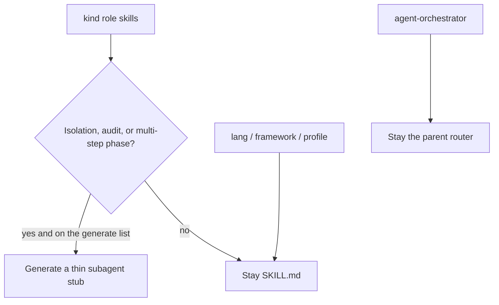
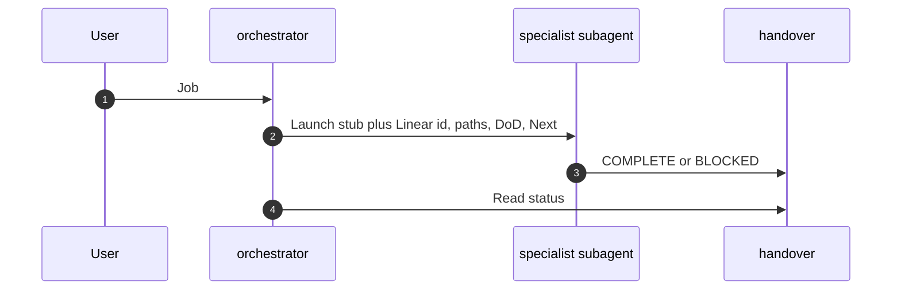

# Host subagent allowlist

Skills stay the playbook (`SKILL.md`). Subagents are a **process boundary**: a fresh Cursor or Claude window, optional `readonly`, optional model class at launch. This page is the published allowlist. The machine-readable copy is [skills/subagents.yaml](../skills/subagents.yaml). Thin host stubs live in [agents/](../agents/) (`wk agents generate`). Install them for the logged-in user with `wk agents install` (also runs on `wk align . --write` and after a successful `wk sync --install`). `wk verify` and `wk check` fail if the allowlist, docs, and stubs drift.

Waykit does **not** turn every `agent-*` role into a host agent. Cursor auto-delegation gets worse when descriptions overlap. Stack profiles never become agents.

## Launch flow

The parent stays in chat. Allowlisted specialists run in a child window. IPC is the handover file.

Procedure: [SOPs/subagent-launch.md](../SOPs/subagent-launch.md). On the map, stubs are `subagent:*` nodes with an `adapts` edge to their skill ([Waykit map](./map.md)).

## Skills-only (`KIT_SKILLS_ONLY`)

Default remains launch. When host subagents cost too much, set `KIT_SKILLS_ONLY=1`. The orchestrator still picks the same allowlisted specialist (spec, tdd, debug, xfn, audit) but loads that role `SKILL.md` in the parent chat. Handover on disk is unchanged. Unset or `0`/`off` returns to launching.

This is not an allowlist freeze and does not delete kit stubs. Eval: `wk eval ci` uses `evals/edd/subagent_routing.yaml` when the switch is off, and the parent-skill replacement `evals/edd/subagent_routing_skills_only.yaml` when it is on.

## Generate list

| Bucket | Skills | Why a subagent |
|--------|--------|----------------|
| Isolation | `agent-debug`, `agent-xfn` | Logs, DOM, and suite output must not fill the parent chat |
| Readonly audit | `agent-review`, `agent-security`, `agent-arch-drift` | Independent check; `readonly: true` |
| Sequential specialists | `agent-spec`, `agent-tdd` | Multi-step phase with a handover contract |

**Parent only:** `agent-orchestrator` routes and launches. It is not a 31st specialist stub.

**TDD:** Gear 1 (domain + mocked ports) and gear 2 (thin adapter) stay **one** `agent-tdd` session. `agent-adapter` stays a skill: the escape hatch when gear 2 is too large, not a second TDD agent.

## Stay skills

| Kind | Runtime |
|------|---------|
| `lang-*`, `framework-*`, `profile-*` | Skill. How to write this stack. Loaded by the specialist. |
| Other `agent-*` roles not in the table above | Skill (copy, docs, pre-commit, grill-me, …) |
| SOPs | On demand via kit-knowledge, never copied into agent files |

## Adding a role

Do not grow the generate list because a role “sounds like an agent.” Freeze this list if auto-delegation picks the wrong specialist **more often than today’s skill picker**. If specialists re-explore the repo, fix the handover before generating more stubs.

Out of this page’s scope: Copilot/Antigravity agent directories. Stubs themselves are generated into [agents/](../agents/). `wk agents install` writes only `~/.cursor/agents` and `~/.claude/agents`.

Related: [skills taxonomy](../skills/README.md), [feature lifecycle](./lifecycle.md), [hosts](./hosts.md), [context budget](../SOPs/context-budget.md), [model routing](../SOPs/model-routing.md), [subagent launch](../SOPs/subagent-launch.md).
