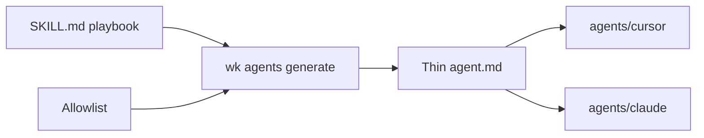

# Subagent allowlist

Iteration 1. This page is the human copy of [`skills/subagents.yaml`](https://github.com/mzworthington/waykit/blob/main/skills/subagents.yaml): which `agent-*` roles become thin Cursor/Claude agent stubs, and which stay `SKILL.md`. `wk agents generate` writes [`agents/`](https://github.com/mzworthington/waykit/blob/main/agents/). Orchestrator launch and host install paths (`~/.cursor/agents`) do not change here.

Cursor’s own guidance: use subagents for isolation, parallelism, and independent verification. Keep skills for one-shot playbooks. Waykit does not emit one agent per role. Stack profiles never become agents.

## Allowlist

| Band | Disposition | Skills |
|------|-------------|--------|
| Pilot isolation | generate-agent | `agent-debug`, `agent-xfn` |
| Readonly audit | generate-agent | `agent-review`, `agent-security`, `agent-arch-drift` |
| Sequential specialists | generate-agent | `agent-spec`, `agent-tdd` |
| Orchestrator | parent only | `agent-orchestrator` |

Every other `agent-*` role stays a skill, including `agent-adapter`. `lang-*`, `framework-*`, and `profile-*` are stay-skill, not generate-agent.

### TDD contract

Gear 1 (domain + mocked ports) and gear 2 (thin adapter + integration test) stay one agent: `agent-tdd`. `agent-adapter` stays the escape hatch when gear 2 is too large. Do not split those gears into two stubs.

### Kill

The generate-agent list is the pilot set above. If someone proposes adding a role, freeze if auto-delegation is worse than today's skill picker. Expanding this list is a kill, not a default.

Stubs carry YAML `name` and `description` (when-to-delegate), `model: inherit`, `readonly: true` on the audit band, and a load-this-skill prompt. Resolve host slugs with `wk model resolve --skill <id>`. Do not hardcode Other-Models ids. `agent-tdd` forbids splitting gear 1 and gear 2.

`wk verify` fails if a stub grows into a playbook or copies SOP/philosophy text.

## Out of scope (this iteration)

- Installing into `~/.cursor/agents`
- Writing files into product app repos
- Changing orchestrator launch behaviour / live Task launches

Taxonomy: [skills/README.md](https://github.com/mzworthington/waykit/blob/main/skills/README.md). Decision: [ADR 0008](./ADRs/0008-subagent-allowlist.md). Feature path: [lifecycle](/docs/lifecycle).
