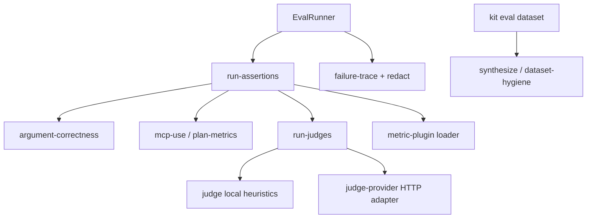

# Eval-Driven Development (EDD) suites

Suite reference for Kit’s agent eval harness. Day-to-day steps in [SOPs/eval-driven-development.md](../../SOPs/eval-driven-development.md). Companion: [SOPs/edd-production-telemetry.md](../../SOPs/edd-production-telemetry.md).

## Layout

```text
evals/edd/
├── README.md
├── system_prompt.md
├── kit_knowledge_prompt.md
├── examples/eval-report.md
├── examples/prod-trace.json
├── architecture_routing.yaml|.jsonl
├── architecture_self_correction.yaml|.jsonl
├── architecture_terminal.yaml|.jsonl
├── kit_knowledge.yaml|.jsonl
├── safety.yaml|.jsonl
└── tools/*.json
```

## Drivers

| Driver | When | What it proves |
|--------|------|----------------|
| `scripted` (CI default) | `kit eval ci`, PR CI (`kit check`), Cursor / Copilot daily work | Harness, schema, keyword routing. **Not** a product LLM test. No API key. |
| Live model | Nightly [`.github/workflows/edd-live.yml`](../../.github/workflows/edd-live.yml) when `KIT_EVAL_API_KEY` is set | Paraphrases, prompt-injection, multi-tool sequences tagged `requires-live` |

Cursor and GitHub Copilot are IDE hosts (`AGENTS.md` → `.cursorrules` / `.github/copilot-instructions.md`). They are **not** the live eval driver: `kit eval` never calls Cursor Chat or Copilot Chat. Env resolution, CI jobs, and a local live example: [docs/edd.md](../../docs/edd.md) (section *Cursor, Copilot, and API keys*).

Do not extend the scripted driver to pass `requires-live` cases. Add JSONL rows instead.

## Quick start

```bash
kit eval run --suite evals/edd/architecture_routing.yaml --model scripted
kit eval ci --suite evals/edd/kit_knowledge.yaml --threshold-routing 95 --model scripted --out out/reports
kit eval ci --suite evals/edd/architecture_routing.yaml --threshold-routing 95 --out out/reports
kit eval ci --suite evals/edd/safety.yaml --threshold-routing 95 --model scripted --out out/reports
kit eval report --format md --out out/reports
kit eval watch --suite evals/edd/architecture_routing.yaml --target evals/edd
```

`agent-kit` aliases `kit`.

## Metrics

| Type | Asserts |
|------|---------|
| `tool_selection` | Correct tool, `expect.no_tool`, or ordered `expect.tools[]` |
| `schema_match` | Valid JSON object args (type/shape; not value meaning) |
| `argument_correctness` | `expect.arguments_contains` / per-call args match intent meaning |
| `task_completion` | User goal achieved (`expect.goal` or expected tool plan); scripted heuristic or live judge |
| `criteria_judge` | Written suite `criteria` + `threshold` (0-1); per-criterion reasons |
| `mcp_use` | Only catalog MCP tools; expected MCP capability when intent requires it |
| `plan_adherence` | Ordered `expect.tools[]` / `expect.tool` matches trajectory steps |
| `step_efficiency` | Tool step count <= `max_steps` (defaults to plan length or 1) |
| `plugin` | Consumer module (`module: ./plugin.mjs`) receives case + trajectory |
| `llm_as_judge` | Semantic accuracy / hallucination / tone (skipped when `expect.no_tool`) |
| `self_correction` | Param updates after injected errors |
| `terminal_fallback` | Circuit breaker stops endless retries |

## Harness layout (hexagonal)



Pure metric and judge logic stays inward. OpenAI-compatible HTTP and dynamic plugin imports live only in adapters.

## Safety suite

Gateable injection / no-tool suite: `evals/edd/safety.yaml` (included in `kit check` via `EDD_CI_SUITES`).

## Dataset hygiene

```bash
kit eval dataset lint --dataset evals/edd/architecture_routing.jsonl
kit eval dataset dedupe --dataset path.jsonl --out path.deduped.jsonl
kit eval dataset synthesize --dataset path.jsonl --count 2 --out path.syn.jsonl
kit eval dataset from-trace --trace evals/edd/examples/prod-trace.json --out out/prod.jsonl
```

Synthetic paraphrases keep expectations, add tags `synthetic` + `requires-live`.

## Tags

| Tag | Meaning |
|-----|---------|
| `routing` | Counts toward routing accuracy |
| `requires-live` | Skipped when the scripted driver is in use |
| `prod-derived` | Converted from a production miss via `productionTraceToJsonl` |
| `prompt-injection` | Instruction-override attempts |

## Reports

| Artifact | Role |
|----------|------|
| `out/reports/eval-report.md` | Stable alias for PR review |
| `out/reports/edd-report.md` | Same Markdown body |
| `out/reports/edd-report.json` | Machine-readable results |

Includes pass rate, tokens/latency, routing + schema adherence, and failure traces. Example: [examples/eval-report.md](./examples/eval-report.md).

Live models (optional): `KIT_EVAL_API_KEY` first, then `OPENAI_API_KEY`, then `ANTHROPIC_API_KEY`. Optional `KIT_EVAL_BASE_URL` / `OPENAI_BASE_URL` (OpenAI-compatible `/chat/completions`; default `https://api.openai.com/v1`), `KIT_EVAL_TOKEN_USD_PER_1K`, `KIT_EVAL_MODEL`. Nightly CI only reads `KIT_EVAL_API_KEY`.
